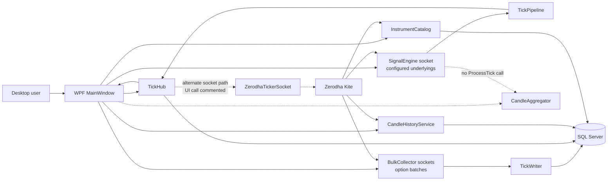
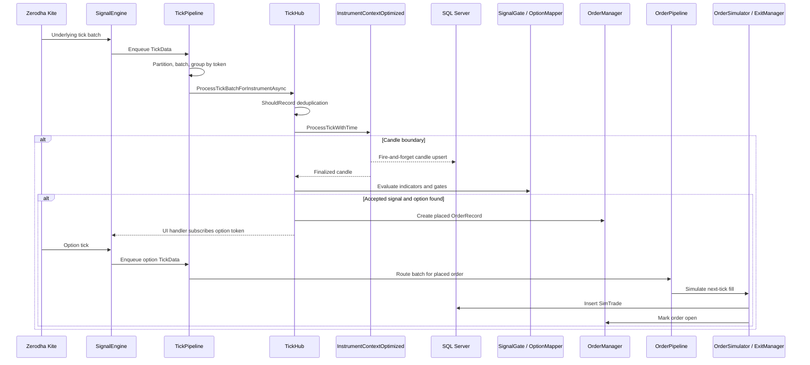
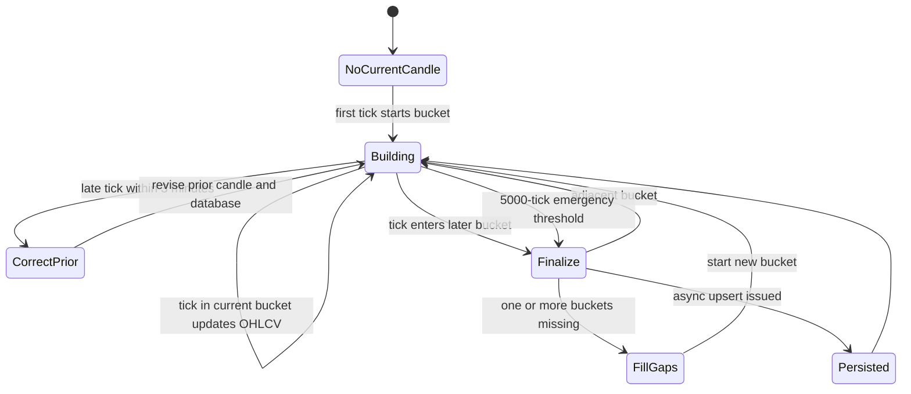
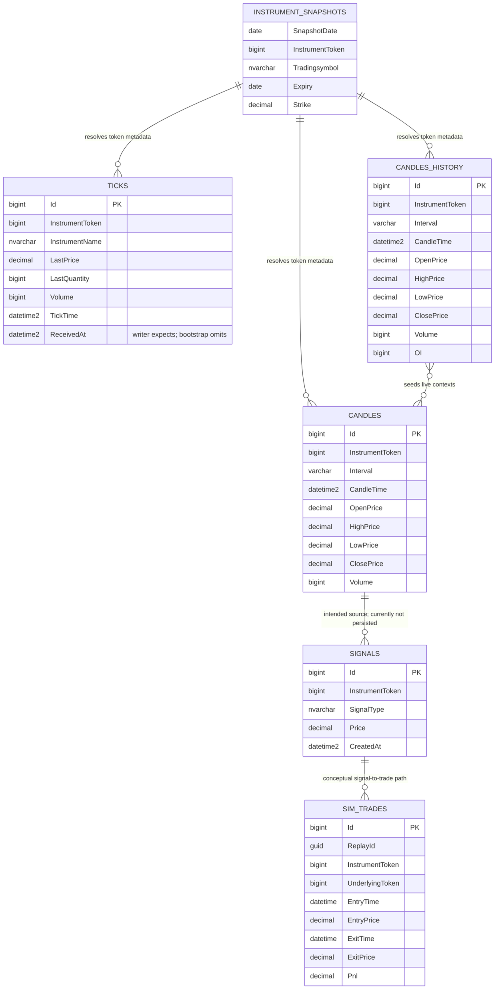
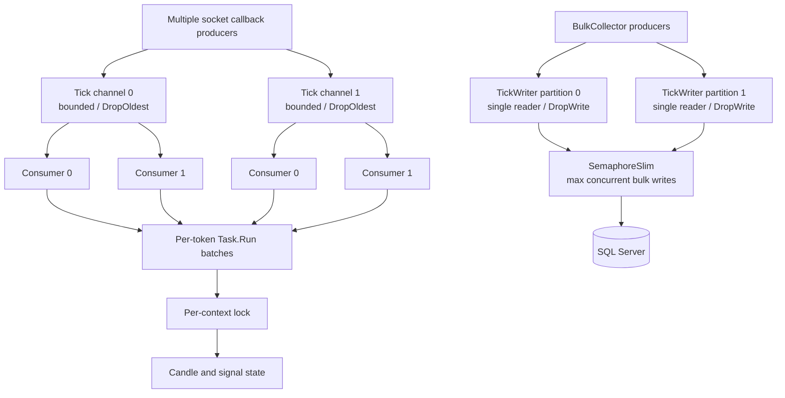

# Current Architecture

## 1. Solution Overview

`ZerodhaOxySocket` is a Windows desktop market-data, candle-generation, signal-evaluation, and paper-trading application built on .NET 8 and WPF. It connects to Zerodha Kite, subscribes to underlying and option instruments, processes live or replayed market data, persists ticks and candles to SQL Server, evaluates a conservative EMA/RSI/ATR breakout strategy, maps accepted signals to options, and simulates order fills and exits.

The repository contains one production application project and one benchmark project:

| Project | Type | Target | Current role |
|---|---|---|---|
| `ZerodhaOxySocket.csproj` | WPF executable | `net8.0-windows` | UI, orchestration, live sockets, pipelines, candle/signal logic, replay, and SQL access |
| `BenchmarkSuite1/BenchmarkSuite1.csproj` | Console executable | `net8.0-windows7.0` | BenchmarkDotNet comparisons for tick-pipeline and tick-writer partitioning |

The production project is a modular monolith. Logical responsibilities are separated into folders and classes, but they compile into one executable and share static configuration, singleton services, in-process events, channels, and direct database access.

There are two overlapping live-ingestion arrangements in the code:

1. **Currently wired by `MainWindow.Connect_Click`:** `SignalEngine` owns a Kite socket for configured underlyings and forwards ticks to `TickPipeline`; `BulkCollector` instances own additional sockets for option ranges and forward ticks to `TickWriter` for persistence.
2. **Available but not currently called by the UI:** `TickHub.Connect()` owns a single `ZerodhaTickerSocket`, normalizes Kite ticks, and forwards them to `TickPipeline`. The call is commented out in `MainWindow.Connect_Click`.

The active candle and signal path is therefore `SignalEngine -> TickPipeline -> TickHub -> InstrumentContextOptimized`. `CandleAggregator` is instantiated and its event is observed by the UI, but no active code calls `CandleAggregator.ProcessTick`; it is not part of the effective candle flow.

## 2. Project Structure

| Path | Responsibility | Architectural notes |
|---|---|---|
| `App.xaml`, `App.xaml.cs` | WPF application lifecycle | Flushes signal diagnostics during application exit |
| `MainWindow.xaml`, `MainWindow.xaml.cs` | Main UI and composition root | Loads configuration, starts services, creates sockets, handles token refresh, charts, status counters, and synchronous shutdown |
| `UI/` | Replay and historical-candle windows | Code-behind directly creates and calls application services |
| `Models/` | Shared tick, candle, signal, order models | Plain mutable CLR objects; `TradingPrimitives.cs` depends on `Clock` for default signal time |
| `Services/TickHub.cs` | Central market-processing coordinator | Context ownership, deduplication, candle evaluation, signal gating, option mapping, order creation, replay routing, and UI events |
| `Services/TickPipeline.cs` | In-memory tick-processing pipeline | Bounded, token-partitioned `Channel<TickData>` arrays with multiple consumers and batch processing |
| `Services/OrderPipeline.cs` | In-memory order-fill tick pipeline | Routes option ticks for placed orders to simulated fill processing |
| `MultiSockets/TickWriter.cs` | Tick persistence pipeline | Token-partitioned channels, batching, and bounded concurrent `SqlBulkCopy` calls |
| `MultiSockets/BulkCollector.cs` | Option-market socket collector | Subscribes option batches, maps Kite ticks, persists them through `TickWriter`, and raises an in-process tick event |
| `MultiSockets/SignalEngine.cs` | Underlying-market socket collector | Despite its name, it currently maps socket ticks into `TickPipeline`; it does not emit its declared `OnSignal` event |
| `MultiSockets/CandleAggregator.cs` | Alternate 1m/5m candle implementation | Present and instantiated, but not fed by the currently wired runtime flow; defines a second incompatible `Candle` model |
| `Services/InstrumentContextOptimized.cs` | Default live candle builder and strategy evaluator | Inline OHLCV state, late-tick correction, gap filling, database upserts, and indicator-based signals |
| `Services/InstrumentContext.cs` | Original candle builder and strategy evaluator | Buffers ticks per candle; retained for comparison/alternate paths |
| `Services/InstrumentContextComparison.cs` | Side-by-side validation adapter | Runs original and optimized candle builders and records differences/performance |
| `Services/CandleFinalizationTimer.cs` | Periodic stale-candle finalizer | Supports only `InstrumentContext`, not the default optimized or comparison contexts |
| `Services/CandleBatchWriter.cs` | Optional batched candle upsert writer | Used only when explicitly supplied to `InstrumentContext`; current `TickHub` construction does not supply it |
| `Services/DataAccess.cs` | SQL Server gateway and partial schema bootstrap | Mixes schema creation, Dapper queries, commands, bulk copy, sync APIs, and async APIs in one static class |
| `Services/CandleHistoryService.cs` | Kite historical candle import | Fetches and inserts `CandlesHistory`; also creates that table on demand |
| `Services/CandleBuilder.cs` | SQL tick-to-candle batch builder | Independent database-side candle-building utility; no active scheduler invocation was found |
| `Services/ReplayEngine.cs` | Tick/candle replay | Creates an isolated `TickHub` and reads historical ticks or aggregated candles from SQL Server |
| `Services/OrderManager.cs`, `ExitManager.cs`, `OrderSimulator.cs` | Paper-order lifecycle | In-memory order state plus SQL-backed simulated trades |
| `Services/UnderlyingCandleCache.cs`, `SignalGate.cs` | Trading state | ATR input cache and per-underlying signal debounce state |
| `Services/Instrument*`, `Helpers/` | Instrument reference data and option lookup | Downloads Kite instrument CSV, snapshots it, resolves names, and selects strikes/expiries |
| `Services/SignalDiagnostics.cs` | Diagnostics | Static background file writer with daily log rotation, plus debug/console output |
| `MultiSockets/OptionSelectorService.cs`, `TradeMonitor.cs` | Alternate option selection/trade monitoring | Connected to the alternate `SignalEngine.OnSignal` path, which currently never emits |
| `BenchmarkSuite1/` | Microbenchmarks | Measures pipeline and writer partition strategies; not a correctness test suite |
| Root `*.md` files | Operational and change documentation | Numerous patch, optimization, validation, and troubleshooting notes; not executable architecture |
| `Temp/` | Manual analysis artifacts | ODS candle/tick comparison files |

## 3. Tick Data Flow

### Active live flow

1. The user refreshes a daily Kite access token through the WPF UI. The token is written to `%LocalAppData%/ZerodhaOxySocket/user_secrets.json`; API key, API secret, and SQL connection string remain in `config.json`.
2. `MainWindow.Connect_Click` calls `TickHub.Init`, starts `TickPipeline`, and then calls `RegisterClasses`.
3. `RegisterClasses` creates:
   - one `TickWriter`;
   - one `SignalEngine` socket for configured underlying tokens;
   - zero or more `BulkCollector` sockets, each handling at most 70 auto-selected option tokens.
4. `SignalEngine` converts each underlying Kite tick to `TickData` and calls `TickPipeline.EnqueueTick`.
5. `TickPipeline` selects a channel with `InstrumentToken % Partitions`. A consumer drains up to 2,000 ticks, groups them by token, and invokes `TickHub.ProcessTickBatchForInstrumentAsync` for each group.
6. `TickHub` applies `ShouldRecord` deduplication, updates UI/LTP events, sends option ticks to `ExitManager`, and forwards price/quantity to the token's candle context.
7. If an order is in `Placed` status for a token, the pipeline also sends that token's batch to `OrderPipeline`, whose consumers call `TickHub.ProcessSignalOrderAsync` to simulate the next-tick fill.
8. In parallel, each `BulkCollector` converts its option Kite ticks to `TickData` and calls `TickWriter.EnqueueTick`.
9. `TickWriter` partitions ticks by token, resolves instrument names, batches records, and calls `DataAccess.InsertTicksBulkAsync`, which uses `SqlBulkCopy` into `dbo.Ticks`.

The underlying `SignalEngine -> TickPipeline` path does not call `TickWriter`, so underlying ticks are processed for candles/signals but are not persisted by that path. An underlying may still be persisted if it is included in the token set returned by `SubscriptionHelper` and therefore subscribed by a `BulkCollector`.

### Alternate single-socket flow

`TickHub.Connect()` can create its own `ZerodhaTickerSocket`, normalize `LastTradeTime` to UTC, and enqueue ticks into `TickPipeline`. This path is implemented but the UI call is commented out. Manual tab subscriptions call `TickHub.SubscribeManual`; these affect the `TickHub` socket only when that socket has been connected.

### Replay flow

`ReplayEngine` runs on a background task and creates a non-singleton `TickHub`:

- Tick mode loads SQL ticks and calls `ProcessReplayTick` directly, bypassing `TickPipeline` and `TickWriter`.
- Candle mode loads SQL-aggregated candles and calls `ProcessReplayCandle` directly.
- Replay order and cache services are intended to be instance-isolated, although several static dependencies remain shared.

## 4. Candle Generation Flow

### Default optimized flow

1. `TickHub.Init` loads up to `Trading.SeedBars` historical bars from `dbo.CandlesHistory` for each configured underlying.
2. Unless comparison mode is enabled, each configured token receives an `InstrumentContextOptimized` using `Trading.TimeframeMinutes`.
3. `ProcessTickWithTime` floors the tick into an IST-aligned bucket through `Clock.FloorToBucketIst`.
4. The context maintains inline current-candle fields: open, high, low, close, accumulated quantity-derived volume, and tick count.
5. A tick in the same bucket updates current OHLCV under `_sync`.
6. A tick in a later bucket finalizes the current candle, creates zero-volume flat candles for missing buckets, and starts a new current candle.
7. A tick in an earlier bucket is accepted only within the three-minute late-tick window and only if the candle exists in `_candleMap`; it can revise high, low, close, and volume.
8. Finalized, gap-filled, and corrected candles are persisted by fire-and-forget calls to `DataAccess.UpsertCandleAsync` or `UpdateCandleAsync`.
9. The in-memory candle list is capped at 1,000 items, while `_candleMap` is not pruned when the list is pruned.
10. `TickHub` evaluates only the last finalized candle returned for a processed batch. If several candle boundaries occur within one batch, earlier finalized candles are stored but only the final returned candle triggers the downstream signal evaluation path.

### Original and comparison flows

`InstrumentContext` stores individual ticks for the current bucket, calculates OHLCV at finalization, retains short-lived late-tick buckets, and optionally writes through `CandleBatchWriter`. `InstrumentContextComparison` sends each tick to both implementations, compares completed candles, and exposes a report. These paths are selectable through code/configuration but are not the normal default.

### Timer and batch builder flows

- `CandleFinalizationTimer` checks every five seconds during regular IST session hours, but its registry is typed as `InstrumentContext`. Because `TickHub` creates optimized or comparison contexts by default, the timer is started with zero supported contexts in the normal configuration.
- `CandleBuilder.BuildCandlesFromTicks` is a separate SQL aggregation utility that can build interval candles from `dbo.Ticks`. No invocation or scheduler for it was found in the current runtime wiring.
- `CandleHistoryService` obtains historical candles from Kite and writes them to `CandlesHistory`; these seed live contexts and replay aggregation.
- `MultiSockets.CandleAggregator` independently models 1m/5m candles, but no active producer calls `ProcessTick`, and its emitted volume is currently always zero.

## 5. Signal Generation Flow

The effective strategy is implemented identically in `InstrumentContext` and `InstrumentContextOptimized`:

1. Signal evaluation runs only after a candle is finalized and only for configured underlying tokens.
2. The context requires enough candles for the maximum of slow EMA, RSI, or ATR period, plus two bars.
3. It calculates fast EMA, slow EMA, RSI, and ATR from the in-memory candle list.
4. It rejects candles whose body percentage is below `MinBodyPct` or whose range is below `MinRangeAtr * ATR`.
5. A buy signal requires fast EMA above slow EMA, RSI at or above `RsiBuyBelow`, a bullish candle, and a close above the previous high.
6. A sell signal requires fast EMA below slow EMA, RSI at or below `RsiSellAbove`, a bearish candle, and a close below the previous low.
7. `SignalGate` suppresses repeated signals of the same type for an underlying within `DebounceCandles * TimeframeMinutes`.
8. `OrderManager` can block another order when multiple open positions are disabled. The check considers `Open` orders; a separate `Placed` order is not included in that gate.
9. `OptionMapper` chooses the nearest expiry and an ATM CE for a buy signal or ATM PE for a sell signal.
10. `TickHub` creates an in-memory `OrderRecord` with `Placed` status and raises `OnOrderCreated` in live processing.
11. The WPF handler subscribes the selected option token on the `SignalEngine` socket.
12. Subsequent option ticks are routed by `TickPipeline` into `OrderPipeline`, which uses `OrderSimulator` to create a `SimTrade`, marks the order `Open`, and registers it with `ExitManager`.
13. `ExitManager` uses underlying ATR, fixed conservative delta assumptions, ATR stop/trail multipliers, and the configured EOD time to close simulated positions.

Current disconnected pieces are significant:

- `TickHub.OnSignal` is declared but never raised.
- `DataAccess.InsertSignal` and `InsertSignalAsync` exist, but no signal-generation path calls them; `dbo.Signals` is therefore not populated by the current strategy flow.
- `MultiSockets.SignalEngine.OnSignal` is declared and observed by `MainWindow`, but `SignalEngine` never raises it. Its UI-side `OptionSelectorService` and `TradeMonitor` flow is consequently dormant.
- Order records are held in memory. Only `SimTrade` rows are persisted, and `OrderManager` comments out order persistence.

## 6. Database Architecture

The application uses SQL Server directly through `System.Data.SqlClient`, Dapper, and `SqlBulkCopy`. There is no repository/unit-of-work abstraction or migration project. Connections are opened per operation and rely on ADO.NET connection pooling.

### Tables created by current code

| Table | Created by | Purpose | Key/index behavior |
|---|---|---|---|
| `dbo.Ticks` | `DataAccess.InitDb` | Full tick persistence and replay source | Identity PK; non-unique index on `(InstrumentToken, TickTime)` |
| `dbo.Candles` | `DataAccess.InitDb` | Live/generated candles | Identity PK; non-unique index on `(InstrumentToken, Interval, CandleTime)` |
| `dbo.Signals` | `DataAccess.InitDb` | Intended signal persistence | Identity PK; non-unique index on `(InstrumentToken, CreatedAt)` |
| `CandlesHistory` | `CandleHistoryService.InsertCandlesInBatches` | Kite historical candles and live seed/replay source | Identity PK; unique constraint on `(InstrumentToken, CandleTime, Interval)` |

### Tables assumed to exist

| Table | Consumers | Current state |
|---|---|---|
| `dbo.InstrumentSnapshots` | `InstrumentCatalog`, `InstrumentSnapshotService`, `DataAccess` | Queried/upserted but not created by repository code |
| `dbo.SimTrades` | `OrderSimulator`, `ExitManager`, `DataAccess` | Inserted/queried/updated but not created by repository code |

### Write patterns

- Ticks: `TickWriter` batches and bulk-copies a `DataTable` into `dbo.Ticks`; synchronous and Dapper batch alternatives also remain in `DataAccess`.
- Live candles: optimized contexts issue per-candle async `MERGE` calls without awaiting them. Original contexts use per-candle update calls unless an optional `CandleBatchWriter` is supplied.
- Batched candles: `CandleBatchWriter` deduplicates by token/time, retries, and runs `MERGE` statements inside one transaction.
- Historical candles: `CandleHistoryService` inserts batches using `WHERE NOT EXISTS` and a database unique constraint.
- Signals: schema and insert methods exist, but no current caller persists generated signals.
- Simulated trades: inserted on fill/unfilled outcome and updated at exit.
- Instrument snapshots: upserted row by row in one transaction and also copied to daily CSV snapshots.

### Read patterns

- Context seeding and replay aggregate 1-minute `CandlesHistory` rows into configured timeframes with SQL CTEs and correlated subqueries.
- Replay reads `Ticks` with `NOLOCK` and time-range filters.
- Option discovery can query distinct tick instruments by symbol pattern and also relies on the downloaded instrument CSV/snapshot.

### Data consistency and time representation

- Incoming `TickHub.Connect` ticks are intended to be canonical UTC; database methods convert ticks and candles to IST wall-clock values.
- `Clock.FloorToBucketIst` returns an `Unspecified` `DateTime` representing IST wall time, despite its comment saying the returned bucket is UTC. Downstream code repeatedly converts possibly-IST values, so the contract is implicit rather than type-safe.
- The `dbo.Ticks` bootstrap DDL does not declare `ReceivedAt`, but all tick insert/bulk-copy paths write that column. A freshly created database from `InitDb` is therefore inconsistent with the current writers.
- Candle `MERGE` logic treats `(InstrumentToken, Interval, CandleTime)` as a natural key, but `dbo.Candles` has only a non-unique index on those columns. Concurrent upserts can still create duplicates.

## 7. Threading and Concurrency Model

| Component | Mechanism | Current semantics |
|---|---|---|
| Kite sockets | Library callbacks | Socket callbacks parse/map ticks and make non-blocking channel writes |
| `TickPipeline` | Bounded `Channel<TickData>[]` plus `Task.Run` consumers | Token modulo partitioning; configured with `DropOldest`; multiple readers per partition; batches up to 2,000; additional task per token group |
| `OrderPipeline` | Bounded channels plus multiple consumers | Token modulo partitioning; `DropOldest`; processes order ticks asynchronously |
| `TickWriter` | One bounded channel/reader per partition | `DropWrite`; batches by size/time; `SemaphoreSlim` bounds concurrent SQL bulk writes |
| `CandleBatchWriter` | One bounded channel and one reader | `DropOldest`; deduplicates, retries, and commits one transaction per batch |
| Candle contexts | Per-context `lock` | Serializes updates within each `InstrumentContext`/`InstrumentContextOptimized` instance |
| Shared maps | `ConcurrentDictionary` | Contexts, last-seen values, diagnostics throttles, orders, and caches use concurrent maps in several services |
| `ExitManager` | Plain `Dictionary` | Mutated by order/tick processing without an internal lock; safety depends on effective call serialization that is not enforced by its API |
| `SignalGate` | Plain `Dictionary` plus private lock | Serializes debounce state |
| `CandleFinalizationTimer` | `System.Threading.Timer` | Five-second callback over registered original contexts during market hours |
| Diagnostics | `BlockingCollection` plus writer task | Unbounded in-memory log queue and one append-to-file consumer |
| Replay | Dedicated `Task.Run` loop | Reads synchronously inside a background task; stop uses cancellation but inner replay loops do not observe the token |
| WPF UI | Dispatcher and `DispatcherTimer` | Service events marshal to the UI thread; some callbacks use synchronous `Dispatcher.Invoke` |
| EOD history | Long-lived `Task.Run` loop | Polls every five minutes until the 16:00 IST window and then performs a history refresh |

Although both `TickPipeline` and `OrderPipeline` state that token partitioning preserves per-instrument ordering, each partition has multiple readers. Two consumers can concurrently drain batches containing the same token, and `TickPipeline` adds another layer of `Task.Run`. Per-context locks prevent simultaneous state corruption, but acquisition order is not guaranteed to match channel order. The current configuration therefore provides mutual exclusion, not strict per-token event ordering.

Backpressure policies intentionally favor recency over completeness. `DropOldest` is used for processing/order/candle channels and `DropWrite` for tick persistence. Counters expose enqueue failures, but `DropOldest` can discard an existing item while `TryWrite` still succeeds, so the published dropped counters do not measure every channel-evicted item.

## 8. Current Dependencies

### Runtime and framework

- .NET 8 Windows target
- WPF and Windows desktop SDK
- `System.Threading.Channels`, tasks, concurrent collections, timers, and `HttpClient`
- SQL Server
- Zerodha Kite HTTP and ticker services
- Local filesystem for configuration, access token, diagnostics, instrument CSVs, snapshots, and comparison reports

### Direct NuGet dependencies

| Package | Version | Usage |
|---|---:|---|
| `OxyPlot.Wpf` | 2.2.0 | WPF charts |
| `OxyPlot.Core` | 2.2.0 | Plot models, axes, and candle series |
| `Newtonsoft.Json` | 13.0.3 | Configuration and local token serialization |
| `Dapper` | 2.1.35 | SQL queries and commands |
| `System.Data.SqlClient` | 4.8.6 | SQL connections, transactions, and bulk copy |
| `Tech.Zerodha.KiteConnect` | 4.3.0 | Authentication, instruments, historical data, and live ticker |
| `BenchmarkDotNet` | 0.15.2 | Benchmark project only |
| `Microsoft.VisualStudio.DiagnosticsHub.BenchmarkDotNetDiagnosers` | 18.3.36726.2 | Benchmark diagnostics only |

There is currently no RabbitMQ client, service bus, dependency-injection container, ASP.NET Core host, SignalR hub, structured logging package, test framework, or database migration package declared by the solution.

## 9. Current Strengths

- The hot tick path uses bounded channels, partitioning, batching, and bounded database concurrency rather than writing every tick synchronously.
- Shared `TickData`, `Candle`, `SignalResult`, and `OrderRecord` models make the processing stages identifiable.
- The default candle builder updates OHLCV incrementally and protects per-instrument state with a lock.
- Late ticks, missing buckets, stale candles, invalid dates, and oversized candle tick counts are explicitly considered.
- Candle upsert behavior and historical-candle uniqueness are designed for repeat processing.
- Live and replay processing reuse substantial candle, signal, option-mapping, and order logic.
- Indicator calculations and trading thresholds are configuration-driven.
- Instrument-token partitioning creates a natural scaling key for independent instruments.
- Tick bulk writes, candle batch writes, channel counters, comparison mode, and BenchmarkDotNet coverage show deliberate performance work.
- Shutdown attempts to complete pipelines and in-flight tick database writes.
- Instrument snapshots and historical candles provide reproducible reference data for replay and startup seeding.
- UTC/IST conversion is centralized more than it would be if conversions were scattered entirely through UI and strategy code.

## 10. Current Weaknesses

- `MainWindow` is both UI and composition root and directly controls sockets, pipelines, database initialization, history import, diagnostics, instrument refresh, charts, and shutdown.
- Static/singleton dependencies (`Config`, `DataAccess`, `TickPipeline`, `OrderPipeline`, `TickHub.Instance`, managers, diagnostics) make lifecycle isolation and deterministic testing difficult.
- Two live socket arrangements and three candle implementations coexist, with partially dormant wiring and duplicate model names.
- The class named `SignalEngine` does not generate signals, while the actual signal engine is embedded in candle contexts and `TickHub`.
- Multiple channel readers undermine the stated per-token ordering guarantee.
- Fire-and-forget database and diagnostic tasks can fail after the originating operation has completed and are not centrally observed.
- Signal records and order records are not persisted through the effective path.
- The default optimized contexts are not registered with the stale-candle timer.
- Tick-processing and tick-persistence paths are separate; persistence coverage depends on which socket subscribed a token.
- Database bootstrap is incomplete and internally inconsistent, particularly `Ticks.ReceivedAt`, `InstrumentSnapshots`, and `SimTrades`.
- Sensitive API and SQL credentials are stored in checked-in `config.json`; the SQL connection string also contains a plaintext password.
- UI event handlers use synchronous dispatcher calls, and `AppendLog` continually appends to a text control, which can pressure the UI thread under high tick rates.
- Broad catch-and-ignore patterns obscure failures and can leave partially initialized or partially persisted state.
- No automated correctness tests were found; benchmarks do not validate financial or concurrency behavior.
- The application is Windows-bound and has no remotely accessible application boundary.

## 11. Technical Debt

### High impact

1. **Secret management:** API key, API secret, and database credentials are committed in plaintext configuration. Existing credentials should be treated as exposed operational data.
2. **Schema drift:** startup DDL and write code disagree on `ReceivedAt`; two required tables lack repository-owned creation; live candle natural keys are not unique.
3. **Ordering contract:** multiple readers and nested task scheduling do not guarantee per-token tick order even though candle open/close and next-tick fills are order-sensitive.
4. **Default stale finalization gap:** the timer supports only the non-default context type.
5. **Unobserved persistence:** optimized candle writes and many diagnostic calls are fire-and-forget.
6. **Incomplete effective signal persistence/eventing:** generated `SignalResult` objects never populate `dbo.Signals` and never raise `TickHub.OnSignal`.

### Medium impact

1. `DataAccess` duplicates sync/async tick, candle, signal, and simulated-trade methods and mixes schema management with operational access.
2. Time values alternate among UTC, IST wall time, local time, and `DateTimeKind.Unspecified`; comments and behavior are not fully aligned.
3. Replay generates a new replay ID for every tick/candle rather than one stable ID per replay session, and cancellation is not checked inside processing loops.
4. Replay tick mode loops once per configured token but calls `GetTicksRange` without a token filter each time, potentially replaying the same full range repeatedly.
5. `StreamTicksRange` accepts a token array but does not use it in its SQL query.
6. `InstrumentContextOptimized` caps `_candles` but not `_candleMap`, allowing long-running map growth.
7. Batch processing retains only the last finalized candle for downstream evaluation, which can skip signal evaluation on earlier boundaries in the same batch.
8. `ExitManager` uses a non-concurrent dictionary while ticks and fills may arrive from multiple pipeline consumers.
9. The channel capacity is applied to every `TickPipeline`/`OrderPipeline` partition even though comments describe it as a total capacity; `TickWriter` divides capacity per partition.
10. Several configuration values and comments are stale or unused, including `TickRetentionWindowMinutes`, `CandleBuilder.RunAt`, `CandleBuilder.Intervals`, email settings, `WritersPerPartition`, and `PaperTrade` behavior in persistence methods.

### Low/structural

1. Duplicate types exist: root `Candle` versus `MultiSockets.Candle`, and root versus `MultiSockets` signal/event types.
2. `CandleAggregator` contains no-op assignments and produces zero volume.
3. `throw ex` in historical import resets stack-trace origin.
4. Nullable reference types are enabled, but many non-nullable fields/properties are initialized with null or are conditionally assigned.
5. Historical queries use `NOLOCK`, trading consistency assumptions are not documented, and correlated subqueries may become expensive at scale.
6. Numerous root patch reports describe prior changes but there is no consolidated automated architecture/test contract.
7. The main project excludes benchmark source through glob overrides because the benchmark project lives beneath the application project directory.

## 12. Components That Are Already RabbitMQ-Ready

No component is directly RabbitMQ-ready in the sense of having RabbitMQ packages, exchanges, queues, publishers, consumers, acknowledgements, retry/dead-letter behavior, or broker health checks. Several components are **conceptually closest to message boundaries** and could supply payloads or routing keys with limited domain changes:

| Component | Existing readiness | Limitation |
|---|---|---|
| `TickData` | Plain data object; instrument token is a natural routing/partition key | Mutable, no message ID/schema version/source metadata, and `DateTime` semantics are ambiguous |
| `Candle` | Plain OHLCV payload with token, name, interval, and time | `Interval` is often not populated by live builders; no finalized/corrected event distinction or version |
| `SignalResult` | Compact strategy decision payload | Lacks instrument identity and durable signal ID; currently nested in an order rather than emitted |
| `OrderRecord` | Has order/signal/replay IDs and explicit status | Mutable state object, not a set of immutable order lifecycle events |
| `TickPipeline` | Producer/consumer boundary, bounded buffering, token partitioning | Static in-process channel; consumer directly calls singleton `TickHub`; no delivery acknowledgement or durable retry |
| `OrderPipeline` | Separate order-related queue and token routing | Carries raw ticks rather than an explicit fill/monitor command and directly calls singleton services |
| `TickWriter` | Consumer-like batching, retries delegated around SQL, token partitioning | Accepts only in-process calls and has no broker acknowledgement/idempotent tick key |
| `CandleBatchWriter` | Single-consumer batching, deduplication, retry/backoff | Private internal message type and static database/config dependencies |
| `BulkCollector` / `SignalEngine` | Clear market-data producer role | Own sockets and concrete downstreams; no publisher abstraction or serialized contract |
| `SignalDiagnostics` | Asynchronous producer/consumer queue pattern | Log strings are unstructured and queue is process-local |

Thus the repository already contains useful queue-shaped seams, partition keys, and payload candidates, but not a broker-compatible implementation boundary.

## 13. Components That Would Require Refactoring

The following components require separation or contract work before they can operate across processes or behind RabbitMQ. This is a current coupling assessment, not a proposed redesign.

| Component | Why refactoring is required |
|---|---|
| `MainWindow` | Directly constructs concrete sockets/services and owns runtime lifecycle; cannot serve as a headless host |
| `TickHub` | Large stateful coordinator coupled to WPF types, static configuration, static database access, singleton managers, concrete option mapping, and in-process events |
| `TickPipeline` / `OrderPipeline` | Static initialization captures config once; consumers directly invoke `TickHub.Instance`; lifecycle cannot be recreated after completion |
| `InstrumentContext*` | Mixes domain state/strategy evaluation with direct persistence and diagnostics; emitted outcomes are return values/fire-and-forget side effects rather than explicit events |
| `DataAccess` | Static SQL Server implementation with no interface, mixed schema/bootstrap/command/query concerns, and both sync and async paths |
| `OrderManager` / `ExitManager` | Primarily in-memory mutable state with singleton access and incomplete durable recovery |
| `ReplayEngine` | Creates concrete `TickHub` and uses static SQL access; replay identity and cancellation semantics are not stable enough for distributed execution |
| `CandleHistoryService` / instrument services | Static clients and state, synchronous calls inside async flows, direct filesystem/SQL/network access |
| `ZerodhaTickerSocket`, `BulkCollector`, `SignalEngine` | Concrete event wiring and dynamic Kite payload mapping are combined with downstream routing |
| Shared models | Need explicit serialization/time/version/idempotency contracts before becoming durable messages or public API DTOs |

## 14. Components That Would Support a React Frontend

There is no HTTP API, WebSocket endpoint, SignalR hub, authentication layer, CORS policy, or ASP.NET Core host in the current solution. A React application therefore cannot connect directly to the repository's current runtime except through a new server boundary.

### Reusable behind a server boundary

| Component | Potential React-facing use | Current constraint |
|---|---|---|
| `TickData` | Live quote DTO | Excess detail and ambiguous time contract |
| Root `Candle` | Historical/live candle DTO | Live `Interval` population is inconsistent |
| `SignalResult`, `OrderRecord`, `SimTrade` | Signal, order, position, and P&L views | Effective signals/orders are partly in-memory and not queryable through a service API |
| `DataAccess` read methods | Historical candles, tick replay, simulated trade history | Static SQL implementation; methods return domain objects directly and several queries are synchronous |
| `TickHub` events | Source for live price/candle/order push | In-process .NET events with WPF-oriented subscribers, not network streams |
| `ReplayEngine` | Replay controls and progress | In-process lifecycle/event callbacks only |
| Instrument catalog/helper logic | Instrument search and option-chain selection | Static filesystem/SQL/Kite dependencies |
| Configuration models | Server-side runtime settings | Include secrets and should not be exposed as frontend configuration |

### Not reusable by React

- `MainWindow`, `InputDialog`, `ReplayWindow`, `CandleHistoryWindow`, WPF XAML, dispatcher logic, and OxyPlot WPF views are desktop presentation components.
- WPF token-refresh behavior launches a local browser and asks the user to paste a request token; it is not a browser-application authentication flow.

The business and data-processing classes could remain behind a .NET server, but the current code has no transport boundary through which React can consume them.

## 15. Recommended Diagrams in Mermaid Format

The following diagrams describe the current implementation. Solid arrows are active runtime calls or data flow; dashed arrows show implemented but dormant/optional paths.

### 15.1 Current runtime container/component view

### 15.2 Tick, candle, signal, and order sequence

### 15.3 Candle state flow

### 15.4 Database relationship view

### 15.5 Concurrency and partitioning view

## Validation Note

This document was derived from all solution/project files, C# sources, XAML, configuration, and repository-level documentation/artifacts present in the workspace. A no-restore solution build was attempted as a structural check, but dependency assets were absent (`obj/project.assets.json`), so compilation could not be verified without restoring NuGet packages. The build reached MSBuild project evaluation and also reported the current `Microsoft.NET.Sdk.WindowsDesktop` deprecation warning.
