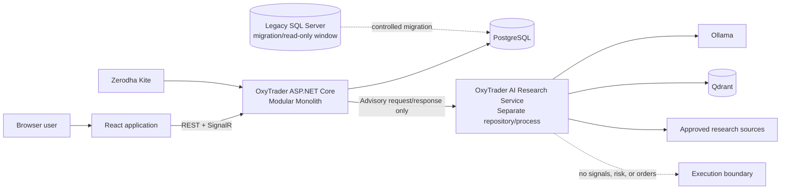
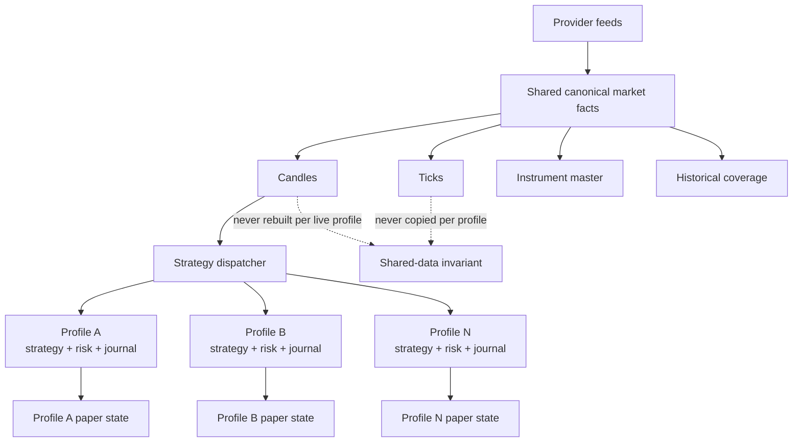
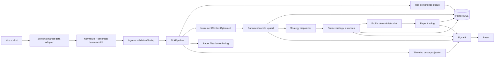
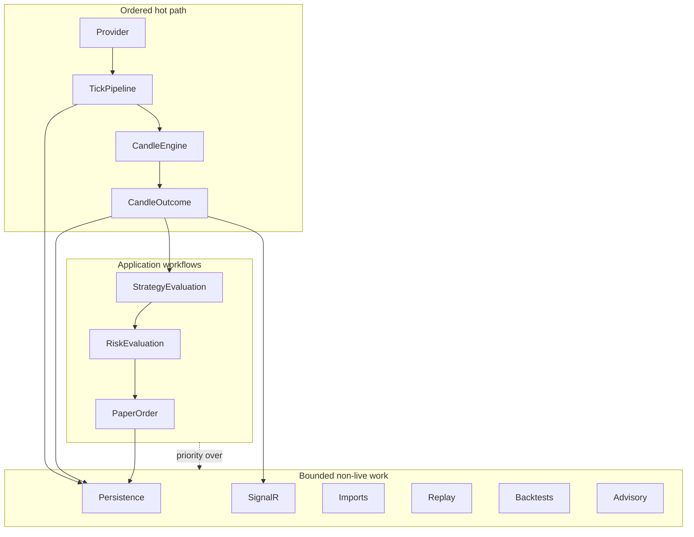
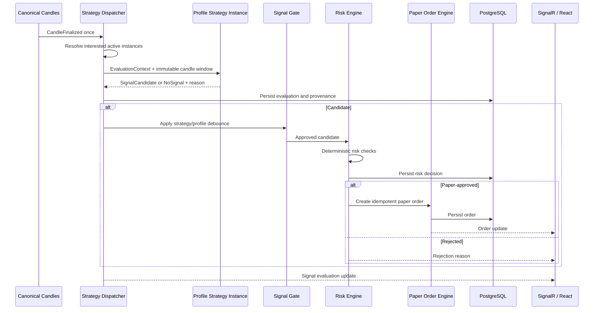
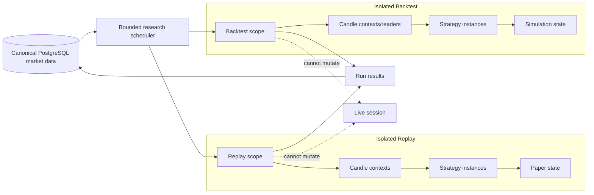
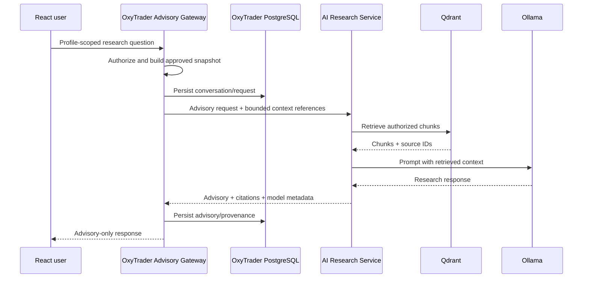

# OxyTrader AI Phase 2 Master Architecture

## 1. Document Status and Scope

This document is the source of truth for OxyTrader AI Phase 2. It supersedes architectural direction in `CURRENT_ARCHITECTURE.md`, `TARGET_ARCHITECTURE_PHASE2.md`, and `VISION_GAP_ANALYSIS.md` while retaining those documents as current-state evidence, target-design history, and decision rationale.

Phase 2 delivers a production-capable modular monolith with an ASP.NET Core backend, a React frontend, PostgreSQL, one shared market-data pipeline, one canonical candle engine, profile-scoped strategy/trading state, paper trading, and first-class replay/backtesting foundations.

This document deliberately does not authorize microservices, RabbitMQ, autonomous AI trading, arbitrary third-party strategy execution, or general live broker execution in Phase 2.

## 2. Executive Summary

OxyTrader AI Phase 2 is one deployable ASP.NET Core backend composed of explicit modules, one React application, and one PostgreSQL database. The backend runs the live Zerodha market feed, the retained `TickPipeline`, the retained `InstrumentContextOptimized` candle engine, deterministic strategies, profile risk controls, paper trading, replay, backtesting jobs, and browser APIs.

Market facts are global and generated once:

- a provider tick is normalized once;
- every accepted normalized tick enters one `TickPipeline`;
- the canonical tick is persisted once;
- one live candle is generated per instrument/interval by `InstrumentContextOptimized`;
- one canonical candle record is consumed by every interested profile strategy;
- historical backfills fill the same canonical market-data model rather than creating a second competing history model.

User/profile state is separate from market facts. Each Strategy Profile owns its strategy instances, risk policy, signals, orders, positions, journal, watchlists, layouts, replay/backtest requests, AI conversations, and advisories. Profiles share canonical instruments, ticks, candles, market calendars, and historical data.

The current Zerodha EMA/RSI/ATR breakout strategy remains behaviorally unchanged during migration. It becomes the versioned built-in `ZerodhaConservativeV1` strategy and is protected by characterization fixtures before code is moved. Paper trading remains the only enabled execution path in Phase 2.

AI is a separate research ecosystem in a separate repository and process. The OxyTrader backend contains only an Advisory Gateway. Ollama, Qdrant, embeddings, RAG, and research orchestration never participate in the deterministic signal or order path and receive no trading-command authority.

RabbitMQ is not a Phase 2 dependency. Hot-path messaging uses bounded in-process channels. Future service extraction and RabbitMQ adoption require measured operational evidence.

## 3. Phase 2 Outcomes

Phase 2 is complete when:

1. The backend runs headlessly without WPF.
2. React supports operational status, instruments, charts, profiles, strategy instances, paper trading, replay/backtesting, and advisory views.
3. PostgreSQL is authoritative and schema-managed by migrations.
4. SQL Server has been migrated, validated, and retained read-only only for the agreed rollback/archive window.
5. Every accepted live tick follows the retained `TickPipeline`.
6. `InstrumentContextOptimized` is the only live candle engine.
7. The current Zerodha signal, option mapping, paper-fill, ATR stop/trail, and EOD behavior passes parity fixtures.
8. One default profile contains migrated current strategy and paper-trading state.
9. Signals and orders carry profile, strategy version/instance, and execution-context identity.
10. Replay and backtests are isolated, cancellable, reproducible, and unable to mutate live state.
11. AI has no code or authorization path to create executable signals or trading commands.
12. Architecture, integration, migration, replay, strategy, risk, and performance tests pass.
13. RabbitMQ, microservices, WPF, alternate candle systems, and SQL Server runtime dependencies are absent from the Phase 2 target runtime.

## 4. Architecture Principles

### 4.1 Modular monolith by default

The backend is one process and one deployable unit. Modules have explicit ownership, contracts, and dependency rules. A module is not a microservice-in-waiting; it is a maintainable boundary inside the monolith.

### 4.2 Optimize for stability and one developer

- Prefer explicit service calls over framework-heavy mediation.
- Use one project per meaningful module, not one project per architectural layer.
- Keep domain, application, and infrastructure folders inside each module project.
- Use architecture tests to enforce namespace/module rules.
- Avoid generic repositories, generic event buses, speculative abstractions, and distributed-system machinery.
- Introduce new infrastructure only when it removes a measured constraint.

### 4.3 Preserve behavior before improving structure

No signal rule, option-selection rule, risk formula, paper-fill rule, candle rule, or market-session rule changes in the same change that moves it across an architectural boundary. Golden fixtures and side-by-side comparisons precede cutover.

### 4.4 One canonical market-data authority

Live normalized ticks and live candles have exactly one authoritative generation path. Profiles, strategies, UI sessions, replay, backtests, journals, and AI research consume shared data; they do not open duplicate live feeds or create profile-specific live candles.

“Generated once” means one authoritative application path with idempotent persistence. It does not assume a network provider can never redeliver a message.

### 4.5 Canonical instrument identity

OxyTrader uses an internal `InstrumentId`. Zerodha tokens and future broker/provider identifiers are mappings, not primary domain identity. `TickPipeline` partitions on the stable canonical instrument key.

### 4.6 Profile ownership is explicit

All user-specific trading and workspace records carry `ProfileId`. Shared market facts never carry `ProfileId`.

### 4.7 Deterministic trading is isolated from AI

Only deterministic, versioned strategies can create signal candidates. Only deterministic risk controls can approve paper/live execution. AI can research, summarize, explain, and advise; it cannot emit an executable signal or invoke a trading command.

### 4.8 UTC internally, exchange time explicitly

Instants use UTC and PostgreSQL `timestamptz`. Exchange bucket/session logic converts through an explicit exchange timezone (`Asia/Kolkata` for Zerodha/NSE). No authoritative value uses ambiguous `DateTimeKind.Unspecified` semantics.

### 4.9 Live work has priority

Live tick, candle, signal, risk, and exit processing take priority over persistence catch-up, browser updates, imports, replay, backtests, and AI research. Every non-live workload is bounded and cancellable.

### 4.10 Extraction follows evidence

Module contracts, ownership, stable identifiers, idempotency, and telemetry create extraction seams. They do not require a broker or separate deployment in Phase 2.

## 5. Architectural Context



## 6. Solution Structure

Phase 2 uses one assembly per meaningful module. Domain/application/infrastructure are folders and namespaces within that module unless a future measured need justifies another assembly.

```text
OxyTrader.sln
|
|-- src/
|   |-- OxyTrader.Api/
|   |   |-- Program.cs
|   |   |-- Composition/
|   |   |-- Endpoints/
|   |   |-- Hubs/
|   |   |-- Authentication/
|   |   `-- Health/
|   |
|   |-- OxyTrader.SharedKernel/
|   |   |-- Identity/
|   |   |-- Time/
|   |   |-- ExecutionContext/
|   |   |-- Results/
|   |   `-- Observability/
|   |
|   |-- Modules/
|   |   |-- OxyTrader.Modules.Profiles/
|   |   |-- OxyTrader.Modules.Instruments/
|   |   |-- OxyTrader.Modules.MarketData/
|   |   |-- OxyTrader.Modules.Candles/
|   |   |-- OxyTrader.Modules.Strategies/
|   |   |-- OxyTrader.Modules.Trading/
|   |   |-- OxyTrader.Modules.Research/
|   |   `-- OxyTrader.Modules.AdvisoryGateway/
|   |
|   `-- OxyTrader.Platform/
|       |-- PostgreSql/
|       |-- Migrations/
|       |-- Logging/
|       |-- Metrics/
|       `-- Secrets/
|
|-- frontend/
|   `-- oxytrader-web/
|       |-- src/app/
|       |-- src/api/
|       |-- src/features/market/
|       |-- src/features/profiles/
|       |-- src/features/strategies/
|       |-- src/features/trading/
|       |-- src/features/research/
|       |-- src/features/advisory/
|       `-- src/shared/
|
|-- tests/
|   |-- OxyTrader.ArchitectureTests/
|   |-- OxyTrader.CharacterizationTests/
|   |-- OxyTrader.ModuleTests/
|   |-- OxyTrader.IntegrationTests/
|   |-- OxyTrader.MigrationTests/
|   `-- OxyTrader.EndToEndTests/
|
|-- benchmarks/
|   `-- OxyTrader.Benchmarks/
|
`-- tools/
    `-- OxyTrader.SqlServerMigration/
```

The separate AI repository is not nested in this solution:

```text
oxytrader-ai-research/
|-- src/AiResearch.Api/
|-- src/AiResearch.Application/
|-- src/AiResearch.Ollama/
|-- src/AiResearch.Qdrant/
|-- src/AiResearch.Ingestion/
|-- tests/
`-- deploy/
```

## 7. Module Boundaries

### 7.1 Profiles

Owns:

- profiles and lifecycle;
- user/profile membership and roles;
- profile settings;
- watchlists;
- journals;
- saved layouts and workspace preferences;
- profile-level feature permissions.

Exposes profile authorization and profile-context resolution. It does not own market facts, strategy definitions, orders, or AI model execution.

### 7.2 Instruments

Owns:

- canonical instruments;
- exchanges, sessions, calendars, and instrument metadata;
- data-provider/broker identifiers and effective-dated mappings;
- instrument search;
- option chains, expiries, strikes, and lot/tick sizes;
- provider instrument imports and reconciliation.

Initially implements Zerodha/Kite mappings while preserving a provider-neutral domain.

### 7.3 Market Data

Owns:

- provider market-data adapters;
- Zerodha socket connections and subscription coordination;
- provider tick normalization;
- ingestion identity and deduplication;
- the retained `TickPipeline`;
- canonical tick persistence;
- live quote projections and market-feed health.

It publishes accepted canonical tick batches to Candles and Trading through explicit in-process contracts. It does not know profiles or strategies.

### 7.4 Candles

Owns:

- the retained `InstrumentContextOptimized` engine;
- one live candle context per required instrument/interval;
- gap and late-tick behavior;
- stale finalization;
- canonical candle persistence;
- historical import/backfill and conflict reconciliation;
- candle queries and coverage.

It emits finalized/corrected canonical candle events once. It does not evaluate profile strategies after the migration compatibility stage.

### 7.5 Strategies

Owns:

- strategy definitions and immutable versions;
- private/shared/public ownership and grants;
- profile strategy installations/instances;
- validated parameter snapshots;
- strategy input requirements and subscription demand;
- deterministic strategy execution;
- signal evaluations and reasons;
- strategy runtime metrics and fault isolation.

`ZerodhaConservativeV1` is the first built-in strategy and preserves current behavior.

### 7.6 Trading

Owns:

- profile risk policies and immutable versions;
- risk checks and kill switches;
- paper orders, fills, positions, P&L, exits, and reconciliation;
- option selection for executable strategy candidates;
- broker account references and adapter contracts;
- future live-order orchestration.

Phase 2 enables only the paper adapter. Trading never accepts AI advisory output as an execution input.

### 7.7 Research

Owns:

- replay sessions;
- backtest runs;
- replay/backtest clocks and isolated scopes;
- dataset/configuration snapshots;
- simulated run orders/trades;
- metrics, equity curves, and comparisons;
- bounded research job scheduling.

It reuses Candles, Strategies, and Trading kernels through run-scoped contracts and cannot mutate live state.

### 7.8 Advisory Gateway

Owns:

- profile AI conversations and messages;
- advisory requests/results;
- authorization and data minimization;
- approved context snapshot construction;
- citations, provenance, model/retrieval metadata;
- communication with the separate AI Research service.

It exposes no signal-generation, risk, order, subscription, or configuration command to the AI service.

### 7.9 API Host

Owns transport, authentication, request validation, composition, health endpoints, REST, SignalR, and hosted-service lifecycle. It contains no trading rules.

### 7.10 Platform

Provides PostgreSQL connection creation, migration execution, structured logging, metrics, tracing, secret resolution, and host-level primitives. It does not own module repositories or business tables. Each module owns its repository implementation and migrations.

## 8. Dependency Rules

1. All modules may depend on the minimal Shared Kernel.
2. No module references the API host or frontend.
3. Module integration uses the producing module's public contract namespace.
4. Domain namespaces do not reference Npgsql, ASP.NET Core, SignalR, Kite, Ollama, or Qdrant.
5. Market Data and Candles do not depend on Profiles.
6. Strategies may query profile strategy instances through Profiles contracts but receives market data through Candles contracts.
7. Trading depends on strategy candidates, profile risk context, and instrument/broker contracts; Strategies does not depend on Trading.
8. Research composes run-scoped contracts from Candles, Strategies, and Trading but those modules do not depend on Research.
9. Advisory Gateway may use read contracts; no module in the execution path depends on Advisory Gateway.
10. Cross-module database queries are prohibited. Read composition occurs in application/API query services using published contracts or purpose-built read models.

Architecture tests enforce these rules.

## 9. Shared and Profile-Scoped Data



| Scope | Authoritative data |
|---|---|
| Global | Providers, instruments, mappings, market calendars, ticks, candles, historical coverage, import provenance |
| User | Identity, broker connections/credential references, user preferences |
| Profile | Strategy instances, risk versions, signals, orders, positions, journal, watchlists, layouts, conversations, advisories |
| Run | Replay/backtest configuration snapshot, progress, results, trades, metrics, logs |

## 10. Canonical Identity and Execution Context

### 10.1 Identifiers

- `InstrumentId`: internal stable identifier used by pipeline, storage, strategies, and runs.
- `ProviderId`: market-data or broker provider identity.
- `ExternalInstrumentId`: provider token/symbol, including Zerodha instrument token.
- `UserId`: authenticated user identity.
- `ProfileId`: trading/workspace boundary.
- `StrategyDefinitionId`: logical strategy identity.
- `StrategyVersionId`: immutable code/graph and parameter-schema version.
- `StrategyInstanceId`: profile-owned configured installation.
- `RiskPolicyVersionId`: immutable risk settings used for a decision.
- `RunId`: replay/backtest identity.
- `SignalId`, `OrderId`, `FillId`, `AdvisoryId`, `ConversationId`: stable lifecycle identities.

### 10.2 Execution context

Every strategy result, signal, order, fill, journal link, and advisory reference carries the relevant execution context:

```text
RunMode: Live | Replay | Backtest
RunId: nullable only for Live
ProfileId
StrategyInstanceId
StrategyVersionId
RiskPolicyVersionId
CorrelationId
OccurredAtUtc
```

Live, replay, and backtest outputs cannot be confused through a nullable replay identifier alone.

## 11. Data Flow Diagrams

### 11.1 End-to-end live flow



### 11.2 Command versus market stream



## 12. Tick Processing Flow

### 12.1 Ingress

1. A provider adapter receives a provider-native tick.
2. It resolves `(ProviderId, ExternalInstrumentId)` to canonical `InstrumentId` through the Instruments module.
3. It creates one immutable normalized tick with UTC event and receive times, provider/source metadata, price/quantity fields, and an `IngestionId`.
4. Validation rejects unknown instruments, invalid prices, impossible timestamps, and unsupported payloads with metrics and structured logs.
5. Deduplication uses a provider sequence/event key when available. Where the provider supplies no stable key, OxyTrader records a best-effort fingerprint and does not claim exactly-once network delivery.
6. The accepted tick enters `TickPipeline` once.

### 12.2 Retained TickPipeline

Phase 2 preserves:

- bounded `Channel<NormalizedTick>` partitions;
- canonical instrument modulo partitioning;
- burst batching;
- non-blocking socket callback ingestion;
- configurable capacity and batch size;
- graceful completion/drain;
- queue, drop, age, throughput, and processing metrics;
- BenchmarkDotNet coverage.

Phase 2 changes lifecycle and ordering, not the backbone:

- `TickPipeline` becomes a DI-managed singleton hosted service;
- each partition has one logical reader;
- a token is processed in channel order;
- partitions run in parallel;
- the batch processor is injected rather than calling `TickHub.Instance`;
- nested unbounded `Task.Run` use is removed;
- overflow policy is explicit and all loss is measured.

The initial policy is to protect process stability while alerting on any loss. The final capacity and overflow policy must be selected from load tests and documented operational tolerance; it is not silently inherited from `DropOldest` behavior.

### 12.3 Fan-out

The ordered batch processor performs fast in-process enqueue/calls to:

- tick persistence writer;
- canonical candle session;
- paper-order fill/exit monitor where a relevant position/order exists;
- coalesced browser quote projection.

Slow persistence, SignalR, replay, import, and AI work never runs inline on the partition consumer.

### 12.4 Subscription coordination

The Market Data module computes a union of requirements from:

- configured shared underlyings;
- active profile strategy instances;
- active profile watchlists requiring live quotes;
- open orders/positions;
- operational monitoring.

One coordinator applies the union to provider sockets and provider limits. Profiles never own sockets.

## 13. Candle Generation Flow

### 13.1 Canonical engine

`InstrumentContextOptimized` remains the only authoritative live candle engine. It retains:

- exchange-time-aligned buckets;
- incremental open/high/low/close/volume;
- current-candle locking;
- missing-bucket gap behavior;
- three-minute late-tick correction behavior unless parity fixtures approve a later change;
- emergency tick-count protection;
- bounded in-memory candle retention;
- stale finalization.

The context returns explicit outcomes rather than writing the database or logs:

```text
NoChange
CurrentCandleUpdated
CandleFinalized
CandleCorrected
GapCandlesGenerated
TickRejected
```

Its candle list and lookup map use the same bounded retention policy.

### 13.2 One live context per key

The Candles module maintains one live context for `(InstrumentId, Interval)` regardless of the number of profiles consuming that candle. Strategy requirements determine which intervals are active, but they do not create duplicate contexts for the same key.

### 13.3 Stale finalization

An ASP.NET Core hosted service checks the optimized context registry using the exchange calendar. Timer-triggered outcomes follow the same persistence and event path as tick-triggered outcomes.

### 13.4 Canonical storage and historical backfill

There is one logical candle store with natural key:

```text
(InstrumentId, Interval, CandleOpenTimeUtc)
```

Authority rules:

1. Live optimized-engine output is authoritative for periods observed live.
2. Provider historical import inserts missing canonical rows.
3. Historical import does not silently overwrite a conflicting live-generated candle.
4. Conflicts are recorded with source/provenance and resolved by an explicit reconciliation operation.
5. Corrections increment revision metadata and retain an audit entry.
6. Replay, backtests, charts, strategies, and AI research query the same canonical candle contract.

Physical PostgreSQL partitions or archives may be added later without changing the logical contract.

## 14. Signal Generation Flow

### 14.1 Preservation of current Zerodha behavior

The current behavior is registered as immutable built-in strategy version `ZerodhaConservativeV1`:

- indicators: fast EMA, slow EMA, RSI, ATR;
- minimum candle body percentage filter;
- minimum range relative to ATR filter;
- buy: fast EMA above slow EMA, configured RSI threshold, bullish candle, close above previous high;
- sell: fast EMA below slow EMA, configured RSI threshold, bearish candle, close below previous low;
- existing debounce behavior;
- CE mapping for buy and PE mapping for sell;
- nearest-expiry/ATM selection behavior;
- next-tick paper fill behavior;
- ATR stop/trail and EOD exit behavior.

Migration rules:

1. Capture production-like ticks and expected candles/signals before extraction.
2. Add unit and characterization tests for indicators and all rejection/acceptance branches.
3. Initially adapt the existing `EvaluateSignalsPositionAware_Conservative` call behind the new strategy interface.
4. Extract it from `InstrumentContextOptimized` only after adapter parity is exact.
5. Shadow-run old and new strategy wrappers on fixtures and controlled live data without duplicate execution.
6. Cut over signal ownership without changing default parameters.
7. Remove old signal code only after persisted signal-by-signal comparison passes.

### 14.2 Deterministic signal pipeline



### 14.3 Signal record

Every evaluation stores:

- stable `SignalId`;
- Profile, strategy instance, strategy version, and risk version;
- Live/Replay/Backtest run context;
- canonical instrument and candle key;
- evaluation timestamp;
- input parameter hash;
- decision (`NoSignal`, `Candidate`, `Blocked`, `Accepted`);
- deterministic reason and indicator snapshot;
- correlation/causation identifiers.

AI output is never accepted as a `SignalCandidate`.

## 15. Strategy Execution Flow

### 15.1 Runtime contract

The strategy runtime uses a small explicit contract conceptually equivalent to:

```csharp
public interface IStrategyEvaluator
{
    StrategyDescriptor Descriptor { get; }
    StrategyEvaluation Evaluate(StrategyEvaluationContext context);
}
```

`StrategyEvaluationContext` is immutable and contains only approved market inputs, profile strategy parameters, execution clock, and run identity. It does not expose database connections, HTTP clients, broker APIs, order services, AI services, filesystem, or mutable global state.

### 15.2 Dispatcher

On a canonical candle event, the dispatcher indexes active strategy instances by instrument/interval requirement and enqueues evaluation work into bounded partitions. Ordering is preserved per `StrategyInstanceId`; concurrency occurs across instances.

Slow/faulting strategies are measured and disabled or quarantined according to policy without blocking candle generation.

### 15.3 Strategy lifecycle

1. A strategy definition/version is registered or installed.
2. A profile creates a strategy instance from a permitted version.
3. Parameters are validated against the version schema.
4. Data/interval requirements contribute to the global subscription/candle union.
5. The instance is tested in backtest/replay.
6. A profile explicitly enables it for paper mode.
7. Future live enablement requires additional promotion, permissions, risk approval, and broker capability checks.

## 16. Profile Architecture

### 16.1 Phase 2 behavior

Phase 2 supports profiles even if the first deployment has one user and one default profile. Existing settings, strategy configuration, signals, and paper state migrate into that default profile.

### 16.2 Profile aggregate

A profile contains or references:

- identity, name, status, owner, and memberships;
- active strategy instances;
- active immutable risk policy version;
- paper/live permissions;
- selected broker account reference where applicable;
- watchlists;
- journal entries and links;
- saved layouts/workspaces;
- replay/backtest requests and saved comparisons;
- AI conversations and advisories.

### 16.3 Isolation

- All profile routes and commands resolve an authorized `ProfileId`.
- All profile queries filter by authorized membership.
- SignalR groups are profile-scoped.
- Profile-owned database rows include `profile_id` and indexed ownership keys.
- Cross-profile data access has explicit administrative authorization and audit.
- Automated integration tests attempt cross-profile access and must fail.

### 16.4 Shared market consumption

Profiles express strategy/watchlist requirements. The global subscription coordinator takes their union. One tick/candle stream is fanned out to interested profile strategy instances; removing one profile requirement only unsubscribes when no other consumer requires the instrument.

## 17. Strategy Ownership Model

### 17.1 Core entities

- `StrategyDefinition`: logical strategy and owner.
- `StrategyVersion`: immutable executable/declarative artifact, manifest, parameter schema, requirements, checksum, and compatibility metadata.
- `StrategyGrant`: permission for selected users/profiles.
- `StrategyInstallation`: accepted strategy version available to a profile.
- `StrategyInstance`: profile-specific parameters, mode, status, and risk association.

### 17.2 Visibility

| Visibility | Meaning |
|---|---|
| Private | Visible and installable only by the owning user/profile |
| Shared | Explicitly granted to selected users/profiles; not publicly discoverable |
| Public | Discoverable in the future marketplace; still requires installation and profile enablement |

Visibility does not imply execution permission. A public strategy version cannot trade merely because it is public.

### 17.3 Ownership and publishing rules

- Versions are immutable; changes create a new version.
- Profiles pin a specific version until explicitly upgraded.
- Signals/orders/runs retain the exact version and parameter hash.
- Public publication requires manifest validation, provenance, compatibility checks, review status, and future signing policy.
- Unpublishing prevents new installs but does not erase historical run provenance.
- Shared/public grants never expose another profile's parameters, journal, trades, or conversations.

## 18. Visual Strategy Builder Roadmap

### Phase 2 foundation

- Define strategy descriptor and parameter schema.
- Define a small versioned strategy intermediate representation (IR) for metadata and future declarative strategies.
- Persist immutable strategy/version/instance identities.
- Keep execution limited to the built-in C# `ZerodhaConservativeV1` adapter.

### Future Horizon A — Read-only visualization

- Render a strategy's inputs, indicators, conditions, risk handoff, and parameters as a graph.
- Display validation errors and data requirements.
- Do not allow graph execution or live promotion yet.

### Future Horizon B — Declarative builder and interpreter

- Add typed nodes for market inputs, indicators, comparisons, boolean composition, time/session filters, and signal candidates.
- Save a versioned JSON graph conforming to a schema.
- Validate cycles, types, warm-up requirements, unavailable data, and unsafe complexity.
- Execute through a deterministic interpreter in replay/backtests first.

### Future Horizon C — Compilation

- Compile validated IR into an internal execution plan, not arbitrary user-supplied C#.
- Cache by strategy-version checksum.
- Prove interpreted/compiled parity with golden runs.
- Apply instruction, memory, and time budgets.

### Future Horizon D — Controlled promotion

- Require successful backtests and paper runs.
- Require immutable version publication and profile opt-in.
- Add review/signing/trust policy for shared/public strategies.
- Permit future live use only through the normal deterministic risk and broker path.

## 19. Strategy Compilation and Execution Roadmap

1. **Built-in adapter:** wrap the existing strategy behind `IStrategyEvaluator` with no behavior change.
2. **Versioned registry:** resolve evaluators by immutable strategy-version key.
3. **Deterministic interpreter:** execute future declarative IR in replay/backtest only.
4. **Execution plan compiler:** convert validated IR into optimized internal operations; no arbitrary code compilation.
5. **Parity certification:** compare interpreter and compiler results across canonical datasets.
6. **Paper promotion:** allow certified versions in bounded paper execution.
7. **Marketplace sandbox:** add package validation, resource limits, trust/signing, and compatibility policy.
8. **Future live promotion:** require explicit profile permission, broker capability, risk controls, kill switches, and operational certification.

Strategy execution never has direct broker, database, network, filesystem, or AI access.

## 20. Paper Trading and Future Live Trading

### 20.1 Phase 2 paper trading

Paper trading is the only enabled execution adapter. It preserves current next-tick fill behavior and ATR stop/trail/EOD behavior under `ZerodhaConservativeV1`, with explicit versioning of fill/risk assumptions.

Paper orders and fills are durable and recoverable. On restart, open/placed state is reconstructed before the live processor reports ready.

### 20.2 Live-readiness boundary

The Trading module defines a future `IBrokerTradingAdapter` but Phase 2 registers no live implementation. The interface covers capabilities rather than assuming all brokers support the same order types.

Future live enablement requires:

- encrypted user-owned broker connection references;
- broker session/token lifecycle;
- capability discovery;
- idempotent client order IDs;
- order/fill/rejection normalization;
- reconciliation with broker truth;
- pre-trade and post-trade risk;
- profile/broker kill switches;
- audit and manual operational controls;
- paper/live visual distinction;
- staged rollout and explicit feature gate.

## 21. Multi-Broker Readiness

### 21.1 Provider-neutral contracts

Separate contracts exist for:

- `IMarketDataProviderAdapter`;
- `IHistoricalDataProviderAdapter`;
- `IBrokerTradingAdapter`;
- `IBrokerAuthenticationAdapter`;
- broker capability descriptions.

Zerodha is the only Phase 2 implementation.

### 21.2 Normalization

Core domain values use canonical instruments, normalized order sides/types/statuses, UTC times, decimal prices, quantities, and explicit capability flags. Provider-specific values remain in adapter metadata and audit payloads.

### 21.3 Multiple market sources

Only one configured authoritative live source produces canonical ticks for a given instrument/session in Phase 2. A future secondary source may be used for health comparison or failover, but it cannot silently create a competing canonical candle stream.

### 21.4 Broker account scope

Broker connections belong to users and may be authorized for selected profiles. Credentials are external secret references, not plaintext database/frontend values.

## 22. Replay and Backtesting Architecture

### 22.1 Shared deterministic kernel

Live, Replay, and Backtest modes share:

- normalized market models;
- `InstrumentContextOptimized` where tick-to-candle generation is needed;
- strategy evaluators;
- signal gates;
- risk rules;
- paper fill/exit models.

They do not share mutable session state.

### 22.2 Replay

Replay is interactive and supports tick and candle modes, speed control, progress, pause/stop, and browser updates. Each replay has one stable `RunId`, replay clock, isolated context registry, strategy/risk snapshot, and profile association.

Tick replay streams selected tokens and observes cancellation. Candle replay reads canonical candles. Replay never writes reconstructed candles into the live canonical store.

### 22.3 Backtesting

Backtesting is a reproducible bounded job with:

- immutable strategy version and parameter snapshot;
- profile/risk snapshot;
- instrument universe;
- warm-up and evaluation periods;
- canonical data cutoff/coverage identity;
- fill, fee, slippage, liquidity, and lot-size model versions;
- deterministic seed where needed;
- trades, equity curve, drawdown, returns, exposure, and rejection metrics;
- comparison/group identity for parameter studies.

### 22.4 Isolation



Research concurrency, memory, CPU, and database scans are bounded. Live readiness degrades or new research jobs are refused before research demand threatens live latency.

### 22.5 Roadmap

1. Correct current replay identity, token filtering, streaming, clock, and cancellation.
2. Move replay into isolated run scopes with persisted status.
3. Add REST commands and profile SignalR groups.
4. Introduce the Backtest run model using the same deterministic kernel.
5. Add metrics/equity curves and comparison views.
6. Add bounded parameter sweeps.
7. Use backtest/paper evidence as a future strategy-promotion gate.

## 23. Event Architecture

### 23.1 Phase 2 mechanisms

- `TickPipeline` uses bounded `Channel<T>` and is the only hot tick backbone.
- Persistence, strategy evaluation, research jobs, SignalR, imports, and advisory requests use separate bounded in-process queues where asynchronous work is required.
- Direct method calls are used for request/response operations.
- Simple module-owned immutable notifications are used for cross-module facts such as `CandleFinalized`, `SignalEvaluated`, and `OrderStateChanged`.
- No RabbitMQ, Kafka, service bus, or distributed event framework is present.

### 23.2 Event envelope

Cross-module notifications carry only required metadata:

```text
EventId
EventType + Version
OccurredAtUtc
CorrelationId
CausationId
RunMode / RunId when relevant
ProfileId when profile-owned
Payload
```

Ticks are not broadcast through a general-purpose application event bus; the hot path remains explicit and allocation-conscious.

### 23.3 Delivery and consistency

- Persist authoritative state before publishing browser notifications.
- Critical commands use stable idempotency keys and database uniqueness constraints.
- A crash may lose non-authoritative in-process UI notifications; clients recover through REST snapshots.
- Long-running jobs persist status and resume/fail deterministically.
- Phase 2 does not introduce an outbox solely for hypothetical RabbitMQ use.
- If a future extracted service requires durable cross-process delivery, an outbox/inbox and RabbitMQ may be introduced at that boundary.

### 23.4 RabbitMQ decision metrics

Consider RabbitMQ only when measurements show one or more of:

- a module must scale or deploy independently;
- in-process failure blast radius is unacceptable;
- cross-process delivery must survive producer restarts;
- external consumers need durable subscriptions;
- bounded channels cannot meet measured isolation requirements;
- research or persistence must run on separate machines.

## 24. Database Architecture

### 24.1 Technology

- PostgreSQL is the Phase 2 primary database.
- Npgsql is the driver.
- Dapper or explicit Npgsql commands are preferred for hot/query-specific paths.
- Npgsql binary `COPY` is used for tick batches.
- `INSERT ... ON CONFLICT DO UPDATE` is used for canonical candle upserts.
- Versioned migrations are the only schema-creation mechanism.
- All operations are asynchronous and cancellation-aware where I/O is involved.

### 24.2 Module schemas

| Schema | Tables |
|---|---|
| `profiles` | `users`, `profiles`, `profile_memberships`, `watchlists`, `watchlist_items`, `journal_entries`, `layouts` |
| `instruments` | `providers`, `instruments`, `instrument_mappings`, `exchange_calendars`, `instrument_import_runs` |
| `market_data` | `ticks`, `candles`, `candle_revisions`, `candle_conflicts`, `market_import_runs`, `subscriptions` |
| `strategies` | `strategy_definitions`, `strategy_versions`, `strategy_grants`, `strategy_installations`, `strategy_instances`, `signal_evaluations` |
| `trading` | `risk_policy_versions`, `broker_connections`, `orders`, `fills`, `positions`, `position_events`, `kill_switch_events` |
| `research` | `runs`, `run_inputs`, `run_progress`, `run_signals`, `run_orders`, `run_fills`, `run_metrics`, `run_series` |
| `advisory` | `conversations`, `conversation_messages`, `advisory_requests`, `advisories`, `advisory_citations` |
| `audit` | `audit_events` |

For solo-developer productivity, migrations live with the owning module and are applied by one host migration runner in a deterministic order.

### 24.3 Key constraints

- instruments: unique canonical identity plus unique effective provider mapping;
- ticks: indexed `(instrument_id, tick_time_utc)` and provider ingestion identity where available;
- candles: unique `(instrument_id, interval_seconds, candle_open_time_utc)`;
- profiles: all owned rows indexed by `profile_id`;
- strategy versions: immutable checksum/version uniqueness;
- strategy instances: unique profile/name or explicit instance identity;
- signals: stable `signal_id` and indexes by profile/strategy/candle/run;
- orders: stable `order_id`, idempotent client key, profile/status indexes;
- runs: stable `run_id`, profile/mode/status/time indexes;
- conversations/advisories: profile ownership and audit indexes.

### 24.4 Data types

| Concept | Type |
|---|---|
| Internal identifiers | `uuid` or stable `bigint` selected consistently; public/lifecycle IDs use `uuid` |
| External provider identifier | `text` to avoid assuming numeric tokens |
| Price/indicator | `numeric(18,6)` unless instrument rules require another explicit precision |
| Quantity/volume/OI | `bigint` |
| Instant | `timestamptz` |
| Exchange/profile date | `date` |
| Flexible versioned metadata | `jsonb` with schema/version field |
| Strategy graph | versioned `jsonb` plus checksum |

### 24.5 Tick retention and partitioning

Ticks are the dominant volume. Before production cutover, load tests determine partition interval and indexes. The default candidate is range partitioning by tick time with instrument/time indexes and BRIN where appropriate. Retention, archival, backup, vacuum, and replay-query needs are documented together.

No time-series extension or secondary database is added without PostgreSQL measurements.

### 24.6 Canonical versus derived data

PostgreSQL is authoritative for application state and AI conversation/provenance metadata. Browser projections, caches, SignalR streams, and Qdrant vectors are derived and rebuildable.

## 25. SQL Server Migration Strategy

SQL Server remains a migration source, not a permanent Phase 2 runtime dependency.

### 25.1 Inventory and mapping

Inventory current tables and actual production columns, including schema drift around `Ticks.ReceivedAt`, `CandlesHistory`, `InstrumentSnapshots`, and `SimTrades`. Define source-to-target mappings, timezone assumptions, precision conversions, duplicate handling, and default-profile ownership.

### 25.2 Migration tool

`OxyTrader.SqlServerMigration` is a repeatable command-line tool that:

- reads SQL Server in deterministic key/time chunks;
- writes PostgreSQL staging tables;
- maps Zerodha tokens to canonical instruments;
- converts known IST wall times to UTC exactly once;
- transforms current signals/trades into default-profile/run-aware records;
- records batch checkpoints and errors;
- can resume safely;
- produces reconciliation reports.

### 25.3 Sequence

1. Rotate/remove exposed secrets and back up SQL Server.
2. Apply PostgreSQL module migrations.
3. Import instruments/provider mappings first.
4. Import historical candles into canonical candle staging.
5. Import ticks in time partitions.
6. Import simulated trades and any usable signal/order history into the default profile.
7. Reconcile duplicate candle keys and timezone boundaries.
8. Validate counts, min/max times, nulls, uniqueness, sampled OHLCV, aggregate volumes, and replay outcomes.
9. Run the new backend in shadow/read-validation mode.
10. Enter a short controlled cutover window: stop ingestion, drain writers, copy final delta, validate, switch configuration, and start PostgreSQL-backed ingestion.
11. Keep SQL Server read-only for the agreed rollback period.
12. Archive/export and remove SQL Server runtime packages after acceptance.

Long-running dual writes are avoided because they create two authorities and complicate solo operations. Rollback uses the controlled window, backups, checkpoints, and read-only source rather than indefinite dual-write logic.

### 25.4 Validation gates

- no unmapped instrument tokens in accepted ranges;
- canonical candle uniqueness;
- UTC/session boundary samples match expected IST buckets;
- replay fixture parity;
- `ZerodhaConservativeV1` signal parity;
- paper trade/P&L sample parity;
- row-count and aggregate reconciliation within documented rules;
- PostgreSQL ingestion and query performance meet thresholds.

## 26. API Architecture

### 26.1 Standards

- Versioned REST under `/api/v1`.
- JSON uses explicit UTC timestamps and stable enum strings.
- RFC Problem Details for errors.
- Cursor/time-range pagination for large market/research queries.
- Cancellation tokens propagated from requests.
- Idempotency keys required for order, run, import, and publication commands.
- Optimistic concurrency/version checks for mutable profile configuration.
- OpenAPI is generated and used to produce the TypeScript client.

### 26.2 Route groups

Global/shared routes:

```text
/api/v1/system
/api/v1/instruments
/api/v1/market-data/quotes
/api/v1/market-data/candles
/api/v1/market-data/coverage
```

Profile-scoped routes:

```text
/api/v1/profiles/{profileId}
/api/v1/profiles/{profileId}/watchlists
/api/v1/profiles/{profileId}/journal
/api/v1/profiles/{profileId}/layouts
/api/v1/profiles/{profileId}/strategies
/api/v1/profiles/{profileId}/risk
/api/v1/profiles/{profileId}/signals
/api/v1/profiles/{profileId}/orders
/api/v1/profiles/{profileId}/positions
/api/v1/profiles/{profileId}/runs
/api/v1/profiles/{profileId}/conversations
/api/v1/profiles/{profileId}/advisories
```

Strategy catalog routes separate definition discovery from profile installation:

```text
/api/v1/strategy-catalog
/api/v1/strategy-catalog/{definitionId}/versions
```

### 26.3 SignalR

SignalR provides presentation updates, not authoritative delivery. Groups include:

- user/profile;
- subscribed instrument/quote;
- replay/backtest run;
- system operators.

LTP updates are coalesced/throttled. Candles, signals, orders, positions, run progress, and health changes are pushed promptly. Reconnecting clients fetch a REST snapshot and then resume live updates.

### 26.4 Authentication and authorization

Phase 2 may deploy with one user, but all profile endpoints use authenticated identity and profile authorization. Broker and AI credentials remain backend-only secret references. Every state-changing command records actor, profile, correlation, and origin.

## 27. Frontend Architecture

### 27.1 Responsibilities

React renders and orchestrates user workflows. It does not calculate authoritative ticks, candles, signals, risk, fills, positions, or P&L.

### 27.2 Feature structure

- application shell/authentication;
- shared market status and connection health;
- instrument search and live subscriptions;
- charting over canonical candles plus coalesced quotes;
- profile switcher and settings;
- watchlists and layouts;
- strategy catalog, installations, instances, and parameters;
- deterministic signal/reason views;
- paper orders, positions, P&L, risk, and kill-switch state;
- journal;
- replay/backtest configuration, progress, charts, metrics, and comparisons;
- AI conversations/advisories clearly separated from signals/trading;
- system diagnostics appropriate to the user role.

### 27.3 State model

- Server state is fetched/cached through a query library.
- Profile ID is explicit in profile state/cache keys.
- SignalR updates patch cached server state; they do not become the sole record.
- Local UI state owns unsaved layout/editor state only.
- Generated API types prevent contract drift.
- Connection/staleness/degraded indicators are first-class.

### 27.4 Performance

Charts request bounded candle ranges. Tick/LTP display is coalesced. Virtualization is used for long lists. The browser never receives the full raw tick stream unless a purpose-built diagnostic endpoint explicitly permits a bounded sample.

## 28. AI/RAG Architecture

### 28.1 Separate service and repository

Ollama, Qdrant, embeddings, ingestion, RAG, and research-agent orchestration live in `oxytrader-ai-research`, deployed separately from the OxyTrader backend.

The Phase 2 trading backend depends only on an `IAiResearchClient` implemented by the Advisory Gateway. AI service unavailability never affects market processing, deterministic strategies, risk, paper exits, or readiness for safe market operation.

### 28.2 Data flow



### 28.3 Authority boundary

The AI service:

- cannot create `SignalCandidate`;
- cannot call risk or order interfaces;
- cannot change strategy/risk/runtime configuration;
- cannot subscribe instruments;
- cannot write canonical ticks/candles/signals/orders/positions;
- has no broker credential;
- receives sanitized, authorized, bounded data;
- returns advisory content and citations only.

### 28.4 Storage ownership

PostgreSQL owns conversations, messages, advisory requests/results, source-document metadata, access control, and citations. Qdrant stores derived chunks/vectors keyed back to authoritative records with embedding model/version, checksum, and profile/access scope.

Qdrant is rebuildable. Indexing supports idempotency, deletion propagation, reindexing, version changes, and drift metrics.

### 28.5 Initial roadmap

1. Advisory Gateway with a disabled/mock client.
2. Separate AI Research service skeleton.
3. Ollama adapter and bounded research prompts.
4. Authoritative conversation/provenance model.
5. Document ingestion, embeddings, and Qdrant indexing.
6. RAG with citations and profile authorization filters.
7. Replay/backtest research summaries.
8. Research assistant workflows that remain outside execution.

No RabbitMQ is required; initial communication is authenticated HTTP/gRPC.

## 29. Observability

### 29.1 Standards

Use structured `ILogger` logging and OpenTelemetry-compatible traces/metrics. Every operation carries correlation and, where relevant, profile/run/strategy/instrument identifiers. Secrets and access tokens are always redacted.

### 29.2 Required technical metrics

- Kite/provider connection and reconnect state;
- subscription counts and provider-limit utilization;
- ticks received, accepted, rejected, deduplicated, and dropped;
- pipeline depth/utilization by partition;
- oldest tick age and per-partition processing latency;
- candle finalization/correction/gap counts and lag;
- database writer queue, batch size, duration, retry, and failure;
- strategy fan-out, evaluation duration, timeout, and failure by version;
- risk approval/rejection counts and reasons;
- order/fill/position reconciliation state;
- SignalR connections, groups, coalesced updates, and failures;
- import/replay/backtest queue time, CPU, memory, progress, and database time;
- AI request latency/failure, token/model metadata, index backlog, and vector drift;
- PostgreSQL pool, query latency, partition size, vacuum, and storage growth.

### 29.3 Health

- Liveness: process/event loop is responsive.
- Readiness: PostgreSQL, migrations, live state recovery, and required market services are ready.
- Degraded: feed disconnected, writer backlog, stale market data, AI unavailable, or research disabled without necessarily failing HTTP liveness.

AI health never gates trading readiness. Research overload never makes the live processor ready if it is falling behind.

## 30. Audit Requirements

Append-only audit events record:

- authentication and profile membership changes;
- broker connection/token lifecycle actions without secrets;
- strategy create/share/publish/install/upgrade/enable/disable;
- parameter and risk-policy changes with before/after version references;
- signal and risk decisions;
- paper/live order commands, adapter responses, fills, exits, and reconciliation;
- kill-switch activation/deactivation;
- replay/backtest creation, cancellation, and result completion;
- journal changes where required;
- AI questions, context snapshot references, provider/model, citations, and advisory classification;
- administrative data reconciliation and migration actions.

Audit records carry actor, profile, timestamp, correlation, source IP/client where appropriate, action, entity/version, and outcome. They are not rewritten by normal application workflows.

## 31. Risk Controls

### 31.1 Phase 2 controls

- paper mode is the default and only enabled execution adapter;
- global and profile kill switches;
- maximum open positions;
- maximum placed/open orders per underlying/instrument;
- duplicate signal/order idempotency;
- market-session and EOD controls;
- stale/missing market-data rejection;
- price/timestamp validation;
- per-profile daily loss and exposure limits where current functionality supports them, otherwise a documented Phase 2 extension;
- startup recovery before accepting strategy execution;
- deterministic risk reason persistence;
- manual operational visibility in React.

### 31.2 Future live controls

- broker/account-level kill switch;
- maximum quantity/notional/order frequency;
- price bands and slippage limits;
- margin/position checks;
- broker reconciliation and unknown-order quarantine;
- circuit breaker after repeated broker failures;
- live-mode promotion workflow and explicit user confirmation;
- immutable audit and alerting.

AI cannot bypass or modify any control.

## 32. Deployment Architecture

### 32.1 Phase 2 topology

```mermaid
flowchart TB
    Browser["Browser"] --> Proxy["HTTPS reverse proxy"]
    Proxy --> React["Static React assets"]
    Proxy --> API["Single active OxyTrader API/worker instance"]

    API --> PG[("PostgreSQL")]
    API --> Kite["Zerodha Kite"]
    API --> Secrets["Secret provider / protected environment"]

    API -->|"optional advisory calls"| AI["AI Research Service<br/>separate deployment"]
    AI --> Ollama["Ollama"]
    AI --> Qdrant[("Qdrant")]

    SQL[("SQL Server") ] -. "migration/read-only rollback window" .-> API
    Backup["Backup/restore storage"] --> PG
```

### 32.2 Active-instance rule

Phase 2 runs one active backend market processor. Starting multiple identical backend replicas would duplicate provider connections, `TickPipeline`, candles, and signals and is prohibited.

If HTTP horizontal scaling becomes necessary, the market-processing ownership boundary must first be separated through leader ownership or a service extraction. A normal web load balancer alone is not safe.

### 32.3 Packaging

Container deployment is preferred for repeatability, but a managed service deployment is acceptable if lifecycle, secrets, logs, backups, and health checks are equivalent. React may be served by the reverse proxy or API host.

PostgreSQL backups, point-in-time recovery policy, restore drills, schema migration rollback/forward policy, log retention, and disk-capacity alerts are required before production use.

## 33. Extraction Boundaries

The modules most likely to justify future extraction are:

| Candidate | Trigger evidence | Boundary already provided |
|---|---|---|
| AI Research | Already separate due technology/security/failure isolation | Authenticated advisory request/response contract |
| Backtest workers | CPU/memory/DB scans affect live latency or require independent scaling | Persisted run jobs, immutable inputs, run-scoped outputs |
| Market-data processor | Need for independently scalable API, stronger availability, or multiple consumers | Canonical tick/candle contracts and provider adapters |
| Tick persistence/archival | Writer/storage throughput or retention operations affect live processing | Bounded writer queue and canonical tick schema |
| Broker execution | Live broker security/reconciliation requires independent blast radius | Broker adapter and idempotent order contracts |
| Notifications/SignalR | Browser fan-out dominates backend resources | Presentation events and REST recovery model |

Extraction requires operational metrics, an ownership review, durable delivery design, deployment/runbook capacity, and a clear benefit exceeding solo-maintenance cost.

## 34. Migration Roadmap

The stages below are implementation stages inside Phase 2, not separate product phases.

### Stage 0 — Stabilize and secure the current system

- Rotate exposed API/SQL credentials and remove secrets from source control.
- Capture golden ticks, candles, late ticks, gaps, signals, option mappings, fills, exits, and replay results.
- Add characterization tests for `InstrumentContextOptimized` and current strategy behavior.
- Record current throughput, memory, queue, database, and replay benchmarks.
- Inventory real SQL Server schema/data quality/time semantics.

**Gate:** Current behavior is reproducible and secrets are controlled.

### Stage 1 — Scaffold the modular ASP.NET Core host

- Create the solution/projects and architecture tests.
- Add DI, typed options, validation, logging, OpenTelemetry, health, graceful shutdown, and secret resolution.
- Move composition from WPF into the host.
- Wrap current SQL Server and Zerodha integrations behind module contracts.
- Run feed/pipeline headlessly without changing behavior.

**Gate:** Backend operates without WPF and current processing remains intact.

### Stage 2 — Establish identities, Profiles, and ownership

- Add canonical instrument/provider mapping contracts.
- Add default user/profile and profile authorization context.
- Add strategy definition/version/instance and risk-version identities.
- Add Live/Replay/Backtest execution context.
- Define shared-versus-profile data invariants and tests.

**Gate:** New state cannot be created without correct global/profile/run ownership.

### Stage 3 — Stabilize TickPipeline and canonical candles

- Convert `TickPipeline` to managed lifecycle with one reader per partition.
- Unify all accepted ticks through the pipeline and persistence fan-out.
- Add canonical instrument identity to normalized ticks.
- Refactor `InstrumentContextOptimized` to emit outcomes.
- Add optimized stale finalization and bounded lookup retention.
- Implement one logical candle contract and backfill conflict rules.
- Benchmark and parity-test every change.

**Gate:** One ordered live tick/candle path matches golden behavior and meets performance thresholds.

### Stage 4 — Preserve and modularize strategy/trading behavior

- Register `ZerodhaConservativeV1` behind the strategy runtime.
- Initially adapt, then parity-extract evaluation from the candle engine.
- Persist complete signal/risk reasons and provenance.
- Move paper order/fill/exit state behind the Trading module.
- Add state recovery, idempotency, and default-profile ownership.

**Gate:** Current signal-to-paper-exit behavior matches fixtures and controlled shadow comparisons.

### Stage 5 — Build and migrate PostgreSQL

- Apply module-owned migrations.
- Implement Npgsql repositories, tick `COPY`, and candle upsert/conflict paths.
- Execute chunked SQL Server migration into staging and canonical tables.
- Validate counts, UTC conversion, uniqueness, candles, signals, trades, and replay parity.
- Perform controlled final-delta cutover.
- Retain SQL Server read-only for rollback window.

**Gate:** PostgreSQL is authoritative, validated, performant, and recoverable.

### Stage 6 — First-class replay and backtesting

- Correct and isolate replay.
- Persist run inputs/progress/results.
- Add bounded scheduler and resource limits.
- Add initial deterministic Backtest runs and metrics.
- Expose REST and SignalR run workflows.

**Gate:** Runs are reproducible, cancellable, profile-scoped, and cannot affect live state.

### Stage 7 — React frontend

- Generate the typed API client.
- Implement system health, market views, profiles, strategies, risk, paper trading, journal, layouts, replay/backtests, and advisory shell.
- Add SignalR groups, throttling, reconnect snapshots, and stale state.
- Run WPF/React acceptance comparison temporarily.

**Gate:** Required operations no longer depend on WPF.

### Stage 8 — Advisory Gateway and separate AI foundation

- Add profile conversation/advisory persistence and strict authorization.
- Deploy the separate AI Research repository/service with mock/Ollama adapter.
- Add request/citation/provenance contracts.
- Keep AI optional and operationally isolated.

**Gate:** AI can answer research questions but has no execution path or readiness impact.

### Stage 9 — Remove legacy code and cut over fully

- Remove WPF/OxyPlot.
- Remove `InstrumentContext`, `InstrumentContextComparison`, `CandleAggregator`, SQL `CandleBuilder`, old candle timer/writer, `TickPipelineOld`, dormant signal path, duplicate models, static `DataAccess`, and SQL Server runtime packages.
- Archive patch documents/manual artifacts outside production source as appropriate.
- Re-run all tests, benchmarks, migration checks, backup/restore drill, and runbooks.

**Gate:** Only the Phase 2 architecture remains in production code.

## 35. Technical Risks

| Risk | Impact | Mitigation |
|---|---|---|
| Signal drift during extraction | Critical | Golden fixtures; adapter-first migration; shadow comparisons; no logic/structure change together |
| Candle drift/timezone errors | Critical | UTC contract; exchange-zone tests; boundary fixtures; sampled SQL migration reconciliation |
| Tick reordering | Critical | One reader per partition; canonical partition key; monotonic/order metrics; replay parity |
| Tick loss/backpressure | Critical | Explicit policy; queue/age/drop alerts; capacity tests; fast downstream enqueue; recovery/runbook |
| Duplicate canonical market data | Critical | One feed authority; ingestion identity; unique keys; one candle context/key; conflict table |
| Profile data leakage | Critical | Required ProfileId, authorization context, query filters, SignalR groups, adversarial integration tests |
| Strategy version ambiguity | Critical | Immutable versions/parameter hashes and provenance on all outputs |
| Research workload starves live path | Critical | Bounded queues/concurrency, admission control, priority, resource metrics, job refusal |
| PostgreSQL migration precision/time/data loss | Critical | Staging, resumable chunks, reconciliation, replay/signal parity, rollback window |
| Process restart loses order state | High | Persist transitions, idempotency, startup recovery before readiness |
| Multi-broker identity lock-in | High | Canonical InstrumentId, provider mappings, adapter metadata/capabilities |
| Marketplace strategy compromises runtime | Critical | No arbitrary code in Phase 2; typed IR, validation, sandbox/resource/trust roadmap |
| AI crosses execution boundary | Critical | Separate repo/process; no trading dependency/credentials; authorization tests; advisory-only types/UI |
| Qdrant drifts from source | Medium | PostgreSQL authority, checksums, embedding versions, idempotent reindex/delete propagation |
| SignalR overload | Medium | Groups, coalescing, bounded queues, REST snapshot recovery |
| One process failure affects all modules | High | Graceful recovery, health, backups, bounded work; extraction only when metrics justify |
| Solo-developer architecture overhead | High | One project/module; explicit calls; minimal Shared Kernel; no broker/mediator/microservice scaffolding |
| Premature RabbitMQ/microservices | High | Decision metrics and explicit Phase 2 prohibition |

## 36. Deferred Features

The following are not Phase 2 deliverables unless separately approved:

- live broker order execution;
- additional broker implementations;
- full multi-user administration/collaboration;
- public marketplace catalog, commerce, ratings, and distribution;
- arbitrary third-party strategy code loading;
- visual strategy graph execution in paper/live mode;
- compiled declarative strategies beyond foundation contracts;
- large parameter-sweep optimization;
- distributed backtest worker fleet;
- advanced RAG ingestion/research-agent workflows beyond initial advisory foundation;
- PostgreSQL read replicas, time-series extensions, or secondary analytical database;
- multiple active market-processing instances;
- microservices;
- RabbitMQ.

Deferred features must use the identities, ownership, versioning, and contracts established here rather than bypassing them.

## 37. Future Evolution Path

### Horizon 1 — Phase 2 foundation

Deliver this modular monolith, PostgreSQL, React, profiles, canonical market data, preserved Zerodha strategy, paper trading, replay/backtest foundation, and Advisory Gateway.

### Horizon 2 — Research and strategy authoring

Expand backtest metrics/comparisons, parameter studies, visual strategy read views, declarative IR editor, deterministic interpreter, Ollama/Qdrant/RAG research workflows, and profile journals linked to experiments.

### Horizon 3 — Controlled strategy ecosystem

Add private/shared/public publication workflows, grants, signing/review, marketplace discovery, compiled execution plans, resource limits, strategy promotion evidence, and multi-user collaboration.

### Horizon 4 — Multi-broker and controlled live trading

Add a second broker to validate abstractions, broker-account operations, reconciliation, stronger risk/kill switches, live promotion workflows, and a narrowly staged live rollout.

### Horizon 5 — Evidence-driven extraction

Use observability to decide whether backtests, market data, broker execution, persistence, or notifications need independent deployment. Introduce RabbitMQ only at a boundary requiring durable cross-process delivery or independent scaling. Keep modules together if measurements do not justify the operational cost.

## 38. Non-Negotiable Guardrails

1. `TickPipeline` remains the core live normalized market-data backbone in Phase 2.
2. `InstrumentContextOptimized` remains the sole authoritative live candle engine.
3. Live ticks/candles/instruments/history are shared global facts, not profile copies.
4. Profile-owned records always carry and enforce `ProfileId`.
5. Strategy versions and run inputs are immutable and reproducible.
6. Existing Zerodha signal behavior is parity-protected during migration.
7. Paper trading precedes live trading.
8. AI never generates executable signals or invokes trading/risk commands.
9. AI/RAG lives in a separate repository and service.
10. PostgreSQL is authoritative; SQL Server is migration/read-only rollback only.
11. RabbitMQ is optional future infrastructure, never a Phase 2 prerequisite.
12. Microservices require measured necessity, not architectural fashion.
