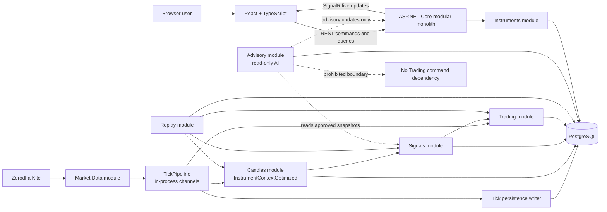
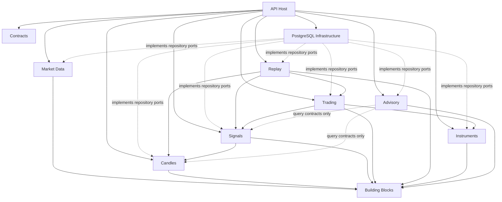
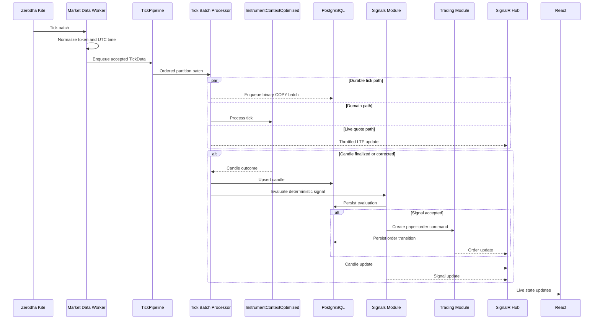
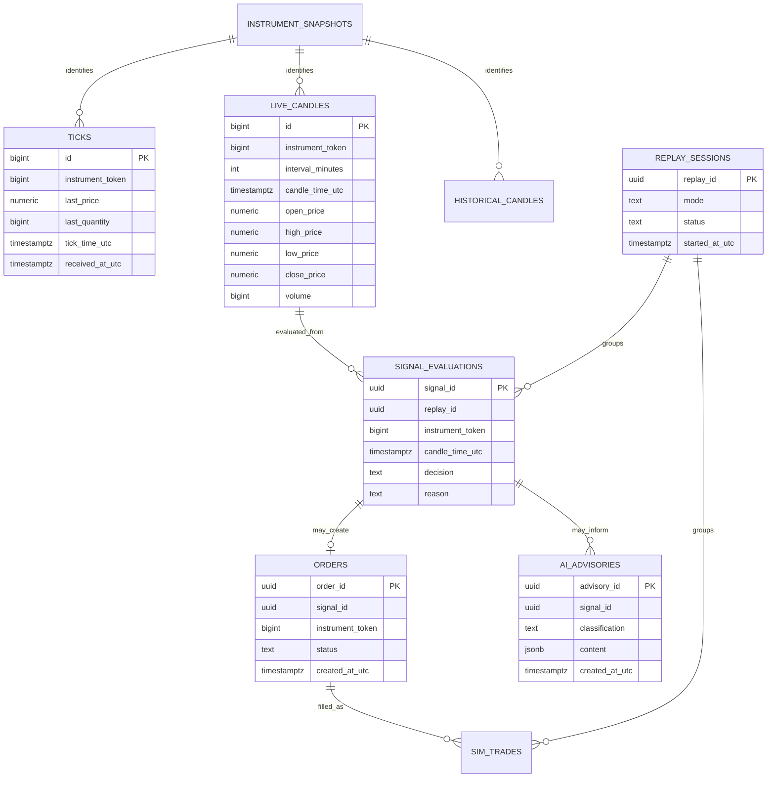

# Target Architecture — Phase 2

## 1. Executive Summary

Phase 2 converts the current Windows-only WPF application into a cross-platform modular monolith with:

- one ASP.NET Core backend process;
- one React frontend;
- PostgreSQL as the system of record;
- the existing in-memory `TickPipeline` retained as the live processing backbone;
- `InstrumentContextOptimized` retained as the only candle-generation implementation;
- replay retained as a first-class backend capability;
- AI isolated to non-executable advisory output;
- RabbitMQ explicitly deferred until Phase 5.

The target remains one deployable backend, not a collection of microservices. Modules are separated by code and dependency rules but communicate in-process. Background workers, HTTP endpoints, SignalR hubs, live market sockets, strategy evaluation, replay, and persistence all run under one ASP.NET Core host and share one PostgreSQL database with module-owned schemas/tables.

Phase 2 preserves existing trading behavior wherever possible. Its main architectural change is to separate presentation, application orchestration, domain processing, and infrastructure so the system can run headlessly, expose stable browser APIs, use PostgreSQL safely, and be tested without WPF or singleton process state.

## 2. Goals and Non-Goals

### Goals

1. Establish a modular monolith with enforceable module boundaries.
2. Replace WPF as the primary presentation layer with an ASP.NET Core backend and React frontend.
3. Replace SQL Server persistence with PostgreSQL.
4. Preserve the bounded, partitioned, in-process `TickPipeline` and its performance characteristics.
5. Preserve `InstrumentContextOptimized` candle and signal behavior while removing its direct infrastructure dependencies.
6. Remove alternate, unused, and comparison candle systems after parity is proven.
7. Preserve tick and candle replay through the same application/domain path used by live processing.
8. Keep AI output informational and incapable of creating, changing, or closing orders.
9. Create a clean foundation for later phases without introducing RabbitMQ in Phase 2.

### Non-goals

- No microservice split.
- No RabbitMQ client, exchange, queue, publisher, consumer, broker retry, or dead-letter queue.
- No event-sourcing conversion.
- No replacement of the current EMA/RSI/ATR conservative strategy.
- No replacement of `TickPipeline` with a broker, cloud stream, or external queue.
- No replacement of `InstrumentContextOptimized` with a new candle algorithm.
- No autonomous or AI-directed trading.
- No live broker order execution unless it already exists outside the architecture described by `CURRENT_ARCHITECTURE.md`; paper trading remains the controlled execution mode for Phase 2.

## 3. Architectural Principles

### 3.1 One deployable backend

All backend modules compile into one ASP.NET Core application and run in one process. The host supplies dependency injection, configuration, health checks, logging, lifecycle management, hosted background services, REST endpoints, and SignalR.

### 3.2 Modules own behavior and persistence

Each module exposes an application-level contract and owns its tables or PostgreSQL schema. Modules do not query another module's tables directly. Cross-module operations use in-process interfaces and application notifications.

### 3.3 Domain code does not perform infrastructure side effects

`InstrumentContextOptimized`, signal rules, order state transitions, and replay decisions return explicit results. PostgreSQL writes, SignalR publication, logging, and Kite subscription changes are handled by application/infrastructure services.

### 3.4 One canonical time contract

Internal and persisted instants use UTC. PostgreSQL instant columns use `timestamptz`. Exchange/session calculations explicitly convert UTC to `Asia/Kolkata`; API timestamps use ISO 8601 with an offset or `Z`. An IST wall-clock bucket is never passed around as an unqualified `DateTimeKind.Unspecified` value.

### 3.5 Preserve ordering by instrument

`InstrumentToken` remains the pipeline partition key. Each partition has one logical consumer so ticks for a token are handled in channel order. Parallelism occurs across partitions, not through competing consumers for the same partition.

### 3.6 Browser clients never hold infrastructure secrets

Kite API secret, access token, PostgreSQL credentials, and any AI provider credential stay in backend secret storage. The React application receives only user-safe data and short-lived application authentication/session state.

### 3.7 AI is advisory only

AI can read approved snapshots and create an advisory record. It cannot call order commands, change strategy settings, subscribe instruments, enqueue ticks, write candles/signals, or participate in risk/exit calculations. The deterministic trading path does not depend on AI availability or output.

## 4. Target Solution Structure

The target uses multiple assemblies to enforce boundaries while retaining one deployable backend.

```text
ZerodhaOxySocket.sln
|
|-- src/
|   |-- ZerodhaOxySocket.Api/
|   |   |-- Program.cs
|   |   |-- Endpoints/
|   |   |-- Hubs/
|   |   |-- HostedServices/
|   |   `-- Composition/
|   |
|   |-- ZerodhaOxySocket.Contracts/
|   |   |-- MarketData/
|   |   |-- Candles/
|   |   |-- Signals/
|   |   |-- Orders/
|   |   |-- Replay/
|   |   `-- Advisory/
|   |
|   |-- ZerodhaOxySocket.BuildingBlocks/
|   |   |-- Time/
|   |   |-- Results/
|   |   |-- Observability/
|   |   `-- InProcessEvents/
|   |
|   |-- Modules/
|   |   |-- MarketData/
|   |   |   |-- Domain/
|   |   |   |-- Application/
|   |   |   `-- Infrastructure/
|   |   |-- Candles/
|   |   |   |-- Domain/
|   |   |   |-- Application/
|   |   |   `-- Infrastructure/
|   |   |-- Signals/
|   |   |-- Trading/
|   |   |-- Replay/
|   |   |-- Instruments/
|   |   `-- Advisory/
|   |
|   `-- ZerodhaOxySocket.Persistence.PostgreSql/
|       |-- Migrations/
|       |-- Connections/
|       `-- TypeMappings/
|
|-- frontend/
|   `-- zerodha-oxy-web/
|       |-- src/api/
|       |-- src/features/market/
|       |-- src/features/candles/
|       |-- src/features/signals/
|       |-- src/features/orders/
|       |-- src/features/replay/
|       |-- src/features/advisory/
|       `-- src/shared/
|
|-- tests/
|   |-- ArchitectureTests/
|   |-- MarketData.Tests/
|   |-- Candles.Tests/
|   |-- Signals.Tests/
|   |-- Trading.Tests/
|   |-- Replay.Tests/
|   `-- IntegrationTests/
|
`-- benchmarks/
    `-- BenchmarkSuite1/
```

The physical implementation may use one project per module or group module layers into fewer projects initially. The required outcome is enforceable dependency direction, not project-count theater.

## 5. Module Responsibilities

| Module | Owns | Exposes |
|---|---|---|
| API host | HTTP/SignalR transport, authentication, composition, process lifecycle | REST endpoints, SignalR hubs, health endpoints |
| Contracts | Versioned API request/response and SignalR payloads | DTOs only; no domain or persistence behavior |
| Market Data | Kite sockets, tick normalization, subscriptions, deduplication, `TickPipeline`, tick persistence writer | Tick ingestion commands, subscription operations, live quote notifications |
| Candles | `InstrumentContextOptimized`, candle session registry, stale finalization, historical candle import | Finalized/corrected candle outcomes and candle queries |
| Signals | Current deterministic EMA/RSI/ATR signal evaluation and debounce | Accepted/rejected signal results and signal history |
| Trading | Option mapping, paper orders, fills, positions, ATR stops/trails, EOD exits | Order commands, order/position queries, lifecycle notifications |
| Replay | Replay sessions, tick/candle readers, virtual replay progress, isolated processing scope | Start/stop/status commands and replay progress/results |
| Instruments | Instrument download, parsing, snapshots, lookup, option/expiry selection | Instrument search and token-resolution operations |
| Advisory | Optional AI request, sanitized context construction, advisory persistence | Read-only advisory queries and notifications |
| PostgreSQL infrastructure | Connections, migrations, SQL mappings, transaction helpers | Module repository implementations |

## 6. Target Runtime Architecture

### 6.1 ASP.NET Core host

The backend host replaces `MainWindow` as the composition root. It starts and stops all long-running services through ASP.NET Core hosted-service lifecycle hooks:

- Kite market-data connection and subscription worker;
- `TickPipeline` worker;
- tick persistence writer;
- optimized candle stale-finalization worker;
- historical-candle import scheduler/manual job runner;
- replay session coordinator;
- SignalR live-update publisher;
- optional advisory worker.

The host exposes liveness and readiness checks for process health, PostgreSQL connectivity, Kite connection state, pipeline saturation, and writer state. A market-feed outage does not make the HTTP process unresponsive; readiness reports the degraded dependency.

### 6.2 React frontend

React is a separate TypeScript application. It uses REST for commands and historical/query data, and SignalR for live data.

Target feature areas:

- connection/session status;
- instrument search and subscriptions;
- live LTP and candle charts;
- signal history and rejection/acceptance diagnostics;
- paper orders, open positions, exits, and P&L;
- replay configuration, start/stop, progress, and results;
- historical-candle import controls;
- advisory display with an explicit **Advisory only — not used for execution** label.

The frontend does not connect to Kite or PostgreSQL directly. It does not calculate authoritative candles, signals, fills, stops, or P&L.

### 6.3 REST and SignalR boundary

Representative endpoint groups:

| Route group | Purpose |
|---|---|
| `/api/system` | Health summary, feed state, pipeline metrics |
| `/api/instruments` | Search, expiries, option lookup, subscription state |
| `/api/candles` | Historical candle queries and import commands |
| `/api/signals` | Signal history and details |
| `/api/orders` | Paper-order and position queries; permitted paper commands |
| `/api/replays` | Create, start, stop, and inspect replay sessions |
| `/api/advisories` | Request and read non-executable advisories |
| `/hubs/market` | LTP, candle, signal, order, replay, and system-status push |

Commands return an operation/session identifier where work continues asynchronously. HTTP requests do not remain open for an entire replay or historical import.

## 7. Target Tick Data Flow

1. The Market Data hosted service receives Kite ticks and maps them once into canonical `TickData` values with UTC timestamps.
2. Every accepted live tick is submitted to the retained `TickPipeline`.
3. `TickPipeline` partitions by instrument token and uses bounded in-memory channels.
4. One consumer per partition reads ordered batches. Batch size, capacity, and backpressure policy remain configurable and observable.
5. The application tick processor applies deduplication once and dispatches the tick to:
   - the token's `InstrumentContextOptimized` session;
   - the tick persistence writer;
   - the order monitoring/fill path when relevant;
   - the throttled live quote publisher.
6. Tick persistence batches use PostgreSQL binary `COPY` through Npgsql rather than SQL Server `SqlBulkCopy`.
7. Candle outcomes are persisted with PostgreSQL upserts and then published in-process to signal/trading handlers and SignalR.

This removes the current split where one socket path processes underlying ticks while another independently persists option ticks. One normalized tick enters one pipeline, and all configured downstream responsibilities observe that accepted tick.

### TickPipeline retention contract

Phase 2 keeps:

- bounded `Channel<TickData>` buffering;
- instrument-token partitioning;
- burst batching;
- configurable capacity and batch size;
- non-blocking producer behavior where required by Kite callbacks;
- enqueue/drop/latency metrics;
- graceful completion and drain on host shutdown;
- BenchmarkDotNet coverage.

Phase 2 refactors:

- static initialization into a DI-managed singleton hosted service;
- direct calls to `TickHub.Instance` into an injected tick-batch processor;
- multiple readers per partition into one ordered reader per partition;
- opaque `DropOldest` loss into an explicit, measurable overflow policy;
- nested per-token `Task.Run` calls into bounded partition-level concurrency.

The pipeline remains in-process. No broker abstraction or RabbitMQ compatibility layer is introduced in this phase.

## 8. Target Candle and Signal Flow

### 8.1 Sole candle engine

`InstrumentContextOptimized` is the only live/replay candle engine in Phase 2. Its preserved behavior includes:

- IST-aligned timeframe bucketing;
- incremental OHLCV updates;
- gap candle generation;
- late-tick correction window;
- bounded candle history;
- emergency tick-count protection;
- signal evaluation inputs and current indicator behavior.

Before structural changes, characterization tests must lock down bucket boundaries, OHLCV values, gap behavior, late ticks, out-of-order ticks, and signal output against captured production samples.

The class is refactored to return explicit processing outcomes, for example current-price update, finalized candle, corrected candle, and generated gap candles. It no longer calls `DataAccess` or `SignalDiagnostics` directly. Application handlers persist and publish those outcomes in order.

The candle session registry owns one optimized context per token and exposes stale finalization for the hosted timer. `_candleMap` retention is bounded consistently with candle-list retention.

### 8.2 Deterministic signal path

The existing conservative EMA/RSI/ATR rules remain authoritative. On each finalized underlying candle:

1. deterministic indicators and candle filters are evaluated;
2. `SignalGate` applies debounce;
3. the open/placed order gate is checked;
4. the accepted or rejected result is persisted;
5. accepted signals are published in-process;
6. the Trading module maps the option and creates a paper order;
7. UI notification occurs through SignalR.

Every signal receives a stable ID, underlying token, strategy/version identifier, candle time, evaluation time, decision, and reason. This closes the current gap where the effective signal path neither raises the declared signal event nor writes the `Signals` table.

### 8.3 Stale finalization

The current `CandleFinalizationTimer` implementation is replaced by a hosted service that operates on the optimized candle-session registry. It uses the same exchange calendar/time service as live processing and emits ordinary candle outcomes so persistence, signals, and UI updates follow the same path as tick-triggered finalization.

## 9. Target Trading and Replay Flow

### 9.1 Paper trading

`OrderManager`, `OrderSimulator`, `ExitManager`, `UnderlyingCandleCache`, `SignalGate`, and `OptionMapper` retain their current responsibilities but become scoped application/domain services rather than global singletons.

Order lifecycle changes are persisted in PostgreSQL. On process restart, open/placed paper orders and positions can be reconstructed before market processing is marked ready. State transitions use explicit commands and results rather than shared mutable objects passed between pipelines.

### 9.2 Replay preservation

Replay remains a dedicated module and supports both existing modes:

- tick replay from persisted ticks;
- candle replay from historical/aggregated candles.

Each replay has one stable `ReplayId`, cancellation token, status, start/end boundaries, selected tokens, mode, speed, progress, and outcome. A replay creates an isolated session scope containing its own candle contexts, signal gate, order manager, exit manager, and candle cache.

Replay reuses the same normalized tick/candle application handlers and deterministic strategy code as live processing but does not publish into live trading state. Replay persistence records are tagged with `ReplayId`, and SignalR groups isolate progress/results per replay and requesting user/session.

Replay corrections included in Phase 2:

- observe cancellation inside data iteration;
- query only selected tokens;
- stream large tick ranges instead of loading them all into memory;
- avoid replaying the full range once per token;
- keep one replay ID for the whole run;
- use replay time, not system wall time, for replay-sensitive decisions.

## 10. PostgreSQL Architecture

### 10.1 Access approach

- Npgsql is the PostgreSQL driver.
- Repository interfaces are defined by modules and implemented in infrastructure.
- Dapper may remain for explicit high-throughput/query SQL.
- Schema migrations become the only supported schema-creation mechanism; application startup no longer executes ad hoc `CREATE TABLE` statements.
- Tick ingestion uses Npgsql binary `COPY` in bounded batches.
- Candle/history upserts use `INSERT ... ON CONFLICT (...) DO UPDATE`.
- All write APIs are asynchronous and accept cancellation tokens.

### 10.2 Target schemas and tables

| PostgreSQL schema | Primary tables | Ownership |
|---|---|---|
| `market_data` | `ticks`, `instrument_snapshots`, `subscriptions` | Market Data / Instruments |
| `candles` | `live_candles`, `historical_candles`, `import_runs` | Candles |
| `signals` | `signal_evaluations` | Signals |
| `trading` | `orders`, `sim_trades`, `positions` | Trading |
| `replay` | `replay_sessions`, replay-tagged results where needed | Replay |
| `advisory` | `ai_advisories` | Advisory |

Required natural keys and indexes include:

- `market_data.ticks`: index on `(instrument_token, tick_time_utc)` and a documented retention policy;
- `candles.live_candles`: unique `(instrument_token, interval_minutes, candle_time_utc)`;
- `candles.historical_candles`: unique `(instrument_token, interval_minutes, candle_time_utc)`;
- `market_data.instrument_snapshots`: unique `(snapshot_date, instrument_token)`;
- `signals.signal_evaluations`: unique stable `signal_id`, plus `(instrument_token, candle_time_utc)` index;
- `trading.orders`: primary `order_id`, indexed underlying/instrument/status;
- `trading.sim_trades`: indexed `replay_id`, instrument, and entry time;
- `replay.replay_sessions`: primary `replay_id` and status/time indexes.

### 10.3 Data types

| Concept | PostgreSQL type |
|---|---|
| Instrument token | `bigint` |
| Price/indicator persisted value | `numeric(18, 6)` unless a narrower existing precision is intentionally retained |
| Quantity/volume/OI | `bigint` |
| Instant | `timestamptz`, stored as UTC |
| Trading/session date | `date` |
| Identifier | `uuid` |
| Signal/order status | constrained text or PostgreSQL enum chosen consistently by the module |
| Flexible diagnostic/advisory metadata | `jsonb` with a versioned contract |

### 10.4 Migration strategy

SQL Server remains read-only during the final verification window. PostgreSQL schema is created by migrations, then data is copied table by table with row counts, key uniqueness, nullability, precision, UTC conversion, and aggregate checks. Live cutover occurs only after replay and candle parity tests pass against PostgreSQL data.

## 11. AI Advisory Boundary

The Advisory module is optional and isolated from the deterministic trading path.

Allowed inputs:

- finalized candles;
- persisted signals and their deterministic reasons;
- read-only position summaries;
- sanitized market/session context;
- replay results explicitly selected for analysis.

Allowed outputs:

- narrative market commentary;
- risk observations;
- anomaly explanations;
- replay summaries;
- suggested questions or scenarios for a human to investigate.

Prohibited capabilities:

- creating, modifying, filling, or closing an order;
- changing strategy thresholds or runtime configuration;
- bypassing `SignalGate`, risk checks, or EOD exits;
- subscribing/unsubscribing instruments;
- writing authoritative candles, ticks, signals, positions, or P&L;
- invoking Trading module command interfaces;
- feeding an AI result back into deterministic signal evaluation.

An advisory is persisted with its input snapshot reference, provider/model metadata, creation time, and an `AdvisoryOnly` classification. The React UI renders it separately from deterministic signals and orders.

## 12. Components to Keep

| Current component | Phase 2 disposition |
|---|---|
| `TickPipeline` | Keep core channel, partitioning, batching, capacity, metrics, and shutdown behavior; host through DI |
| `InstrumentContextOptimized` | Keep as sole candle engine and preserve its algorithm through characterization tests |
| Root `TickData`, `Candle`, `SignalResult`, `OrderRecord`, `SimTrade` concepts | Keep domain meaning; separate internal domain models from public API contracts |
| `IndicatorHelper` | Keep deterministic calculations; add unit/characterization tests |
| `SignalGate` | Keep debounce behavior; move into Signals module scope |
| `UnderlyingCandleCache` | Keep ATR cache responsibility; make session-scoped for replay |
| `OptionMapper` and relevant `InstrumentHelper` logic | Keep option/expiry behavior behind Instruments application interfaces |
| `OrderManager`, `OrderSimulator`, `ExitManager` | Keep paper-trading behavior; persist lifecycle and remove singleton access |
| `ReplayEngine` behavior | Keep tick and candle modes; refactor lifecycle, isolation, streaming, identity, and cancellation |
| `CandleHistoryService` behavior | Keep Kite historical import; refactor into hosted/application job plus PostgreSQL repository |
| `InstrumentCatalog` and snapshot behavior | Keep download/snapshot/lookup capability; move network/filesystem/database concerns behind interfaces |
| `ZerodhaTickerSocket` Kite adapter | Keep the concrete integration; expose normalized ticks to Market Data module |
| `BenchmarkSuite1` | Keep and relocate under `benchmarks/`; update benchmarks for the DI-managed pipeline and PostgreSQL writer |
| Existing configuration values that drive active behavior | Keep as typed ASP.NET Core options with validation and secret separation |

## 13. Components to Refactor

| Current component | Target responsibility |
|---|---|
| `MainWindow` orchestration | Move composition/lifecycle to `Program.cs` and hosted services; move views to React |
| `TickHub` | Split into focused application services: tick processor, candle session registry, signal coordinator, order coordinator, and live-update publisher |
| Static `TickPipeline` | DI-managed singleton with hosted lifecycle and injected batch processor |
| `OrderPipeline` | Keep as a DI-managed bounded in-process order-monitoring pipeline with injected Trading handlers and explicit lifecycle |
| `InstrumentContextOptimized` infrastructure calls | Return outcomes; inject no database, logging, UI, SignalR, or AI dependencies |
| `CandleFinalizationTimer` capability | Implement as an optimized-context hosted worker using the shared session registry |
| `TickWriter` | PostgreSQL tick writer using Npgsql binary `COPY`; receive accepted ticks from the unified pipeline |
| `DataAccess` | Replace with module-owned PostgreSQL repositories and migrations; eliminate static access and duplicate sync/async methods |
| `SignalDiagnostics` | Replace call sites with structured `ILogger`; expose selected operational metrics rather than raw log strings to React |
| `SignalEngine` | Rename/recast as a Kite underlying market-data adapter; remove unused signal event semantics |
| `BulkCollector` | Consolidate as partitioned Kite subscription collectors that all feed the same `TickPipeline` |
| `CandleHistoryService` | Remove static state and `.Result`; implement cancellable, rate-aware import jobs with progress persistence |
| `ReplayEngine` | Stable session identity, scoped dependencies, streaming reads, cancellation, and SignalR progress |
| `OrderManager` / `ExitManager` | Thread-safe scoped state plus PostgreSQL recovery and explicit transition persistence |
| Clock/session utilities | Explicit UTC instant and exchange-zone APIs; remove ambiguous `DateTime` conversions |
| Configuration/token handling | ASP.NET Core options and external secret storage; backend-only Kite token workflow |
| WPF event payloads | Replace with internal notifications and versioned REST/SignalR contract DTOs |

## 14. Components to Remove

Removal occurs only after optimized-engine parity and replacement-path tests pass.

| Component | Reason for removal |
|---|---|
| `Services/InstrumentContext.cs` | Superseded candle implementation; `InstrumentContextOptimized` is the target engine |
| `Services/InstrumentContextComparison.cs` and comparison report models | Temporary validation mechanism; parity becomes automated characterization/integration tests |
| `MultiSockets/CandleAggregator.cs` and its duplicate `Candle` type | Dormant alternate candle system with zero-volume behavior |
| `Services/CandleBuilder.cs` | Unscheduled SQL tick-to-candle alternate path; conflicts with one authoritative candle engine |
| Current `Services/CandleFinalizationTimer.cs` implementation | Typed to the removed original context; replaced by optimized-context hosted service |
| Current `Services/CandleBatchWriter.cs` implementation | Optional path tied to the removed original context and SQL Server; replaced by module persistence flow |
| Dormant `MultiSockets.SignalEngine.OnSignal` flow | Never emits; deterministic signals come from the retained optimized path |
| `MultiSockets/OptionSelectorService.cs` and `TradeMonitor.cs` alternate UI flow | Attached only to the dormant signal path and duplicates active trading responsibilities |
| `TickPipelineOld.cs` | Superseded pipeline implementation |
| Duplicate synchronous `DataAccess` methods | Replaced by cancellable PostgreSQL repositories |
| WPF projects/files after React acceptance | React becomes the supported presentation layer; no desktop composition remains |
| OxyPlot WPF dependencies | Browser charting replaces desktop chart rendering |
| SQL Server packages and bootstrap SQL | Replaced by Npgsql and PostgreSQL migrations |

Root historical patch documents and `Temp` analysis artifacts may be archived outside the production source tree, but they are not runtime removal blockers.

## 15. Migration Roadmap

The stages below are delivery stages inside Phase 2. They are not the program's numbered product phases; RabbitMQ remains deferred to the later product **Phase 5**.

### Stage 0 — Baseline and safety net

- Freeze representative tick, candle, late-tick, gap, signal, order, and replay datasets.
- Add characterization tests around `InstrumentContextOptimized`, indicators, option mapping, signal gating, stops/trails, and replay output.
- Capture current throughput, queue depth, drop rate, candle parity, and database write benchmarks.
- Rotate exposed credentials and remove production secrets from repository configuration.
- Define canonical UTC/API/PostgreSQL time rules.

**Exit criterion:** Repeatable tests describe current authoritative behavior and secrets are no longer source-controlled.

### Stage 1 — Create the ASP.NET Core modular host

- Add API, Contracts, BuildingBlocks, module, and test projects.
- Configure dependency injection, typed options, structured logging, health checks, and graceful hosted-service shutdown.
- Move composition out of WPF without changing the candle/signal algorithms.
- Wrap current Kite and SQL Server implementations temporarily behind interfaces to establish seams.

**Exit criterion:** The backend starts headlessly, reports health, and can run the current feed/pipeline path without WPF.

### Stage 2 — Stabilize the retained processing core

- Convert `TickPipeline` from static state to a hosted DI-managed service.
- Enforce one consumer per partition and preserve per-token order.
- Unify tick processing and persistence downstream of the same accepted tick.
- Make overflow policy and all losses observable.
- Refactor `InstrumentContextOptimized` to emit outcomes rather than perform persistence/logging.
- Implement the optimized stale-finalization hosted service.
- Persist and publish deterministic signal outcomes.

**Exit criterion:** Live captured ticks produce the same candles/signals as the baseline, with deterministic ordering and no alternate candle path.

### Stage 3 — Introduce PostgreSQL

- Add versioned PostgreSQL migrations for all owned tables, constraints, and indexes.
- Implement Npgsql/Dapper repositories and binary tick `COPY`.
- Implement `ON CONFLICT` candle/history upserts.
- Import SQL Server data with explicit UTC conversion and verification reports.
- Run replay and aggregate parity checks against PostgreSQL.
- Switch backend reads/writes to PostgreSQL, retaining SQL Server read-only during the verification window.

**Exit criterion:** PostgreSQL is authoritative; row counts, candles, signals, simulated trades, and replay results satisfy agreed parity checks.

### Stage 4 — Preserve and expose replay

- Refactor replay into isolated session scopes.
- Add stable replay IDs, streaming reads, cancellation, status persistence, and progress notifications.
- Expose replay REST commands and SignalR groups.
- Verify live state cannot be mutated by replay sessions.

**Exit criterion:** Tick and candle replay complete, cancel, and recover status through backend APIs with results matching baseline fixtures.

### Stage 5 — Build the React frontend

- Implement authenticated API client and SignalR connection.
- Migrate system/feed status, subscriptions, charts, signals, paper orders, history import, and replay workflows.
- Add clear connectivity, stale-data, degraded-backend, and advisory-only UI states.
- Run WPF and React in parallel only for acceptance comparison; do not keep both as permanent composition roots.

**Exit criterion:** All required operational workflows are available through React and no backend lifecycle depends on WPF.

### Stage 6 — Remove obsolete systems and cut over

- Remove original/comparison/alternate candle systems, old pipeline, dormant signal UI path, SQL Server code, WPF, and OxyPlot.
- Remove temporary compatibility adapters and feature flags.
- Re-run architecture tests, integration tests, replay parity, and performance benchmarks.
- Update deployment, backup, recovery, and operational runbooks.

**Exit criterion:** One ASP.NET Core backend, one React frontend, one PostgreSQL store, one tick pipeline, and one candle engine remain.

RabbitMQ work is not part of any Phase 2 stage. Phase 5 may evaluate broker introduction from measured operational needs and stable module contracts.

## 16. Refactoring Sequence

The following order minimizes simultaneous change to transport, storage, and trading behavior:

1. Add tests and captured fixtures before moving code.
2. Extract pure contracts for clock, repositories, market feed, live updates, and tick-batch processing.
3. Create the ASP.NET Core host and move lifecycle/composition from WPF.
4. Host the existing `TickPipeline` behind an instance lifecycle without changing its batch payloads.
5. Establish ordered single-consumer partitions and benchmark the change.
6. Route all normalized ticks through the unified pipeline.
7. Characterize and then remove infrastructure calls from `InstrumentContextOptimized`.
8. Add the optimized candle session registry and stale-finalization worker.
9. Split `TickHub` orchestration into Market Data, Candles, Signals, and Trading application handlers.
10. Persist signal decisions and order transitions through interfaces while still on the temporary SQL Server adapter.
11. Refactor replay to use those interfaces and isolated scopes.
12. Create PostgreSQL migrations and repository implementations.
13. Copy and verify data; switch replay first, then historical reads, then live writes.
14. Expose REST and SignalR contracts.
15. Build React features against those contracts.
16. Run side-by-side acceptance and performance tests.
17. Remove WPF and obsolete candle/pipeline/database implementations.
18. Enable the advisory module only after the deterministic path and permission boundary are tested.

Transport, processing, and persistence should not all be switched in one release. Each step needs an observable rollback boundary until PostgreSQL and the web UI are accepted.

## 17. Risk Analysis

| Risk | Probability | Impact | Mitigation / acceptance evidence |
|---|---|---|---|
| Candle or signal drift while extracting `InstrumentContextOptimized` | Medium | Critical | Golden tick fixtures, candle-by-candle parity, indicator/signal snapshots, no algorithm change in extraction commit |
| Tick reordering changes open/close or next-tick fills | Medium | Critical | One consumer per partition, sequence-aware tests, per-token monotonic-time metrics, replay parity |
| Throughput regression from DI/application boundaries | Medium | High | Keep allocation-free hot contracts, benchmark every pipeline stage, batch persistence/publication |
| PostgreSQL precision/time conversion changes outcomes | Medium | Critical | Explicit UTC conversion, precision contract, sampled OHLCV/P&L checks, dual-store comparison before cutover |
| Tick `COPY` batches lose data on shutdown/failure | Medium | High | Bounded flush interval, tracked in-flight batches, graceful drain, retry policy, batch metrics and reconciliation |
| Unified pipeline overloads because persistence joins processing | Medium | High | Independent bounded downstream writer, fast enqueue from processing, saturation metrics, capacity/load tests |
| Signal/order duplication after retries or restart | Medium | Critical | Stable IDs, unique constraints, idempotent state transitions, startup state recovery |
| Replay contaminates live singleton state | Medium | Critical | No mutable global singletons, replay DI scope, separate session registry, isolation integration tests |
| Removing comparison candle system too early | Low | High | Remove only after automated optimized parity suite replaces manual comparison reports |
| React/SignalR floods browser or backend | Medium | Medium | Throttle/coalesce LTP updates, publish every finalized candle/signal/order, bounded client queues, reconnect snapshots |
| Historical import exceeds Kite limits or blocks host | Medium | Medium | Cancellable background jobs, rate control, persisted progress, health separation |
| Incomplete schema migration misses assumed tables/columns | Medium | High | Inventory-driven migrations for ticks, candles, history, signals, snapshots, orders, sim trades, replay, advisory |
| Credential exposure persists | High until corrected | Critical | Rotate current credentials, external secret provider/environment variables, frontend never receives secrets |
| AI advice is mistaken for execution authority | Medium | Critical | Separate module/DB/API/UI, no Trading command dependency, authorization tests, immutable `AdvisoryOnly` classification |
| Premature RabbitMQ abstractions complicate Phase 2 | Medium | Medium | No RabbitMQ packages or broker interfaces; use simple in-process notifications and revisit only in Phase 5 |
| Cutover cannot be rolled back cleanly | Low/Medium | High | Versioned deployment, SQL Server read-only verification window, database backups, explicit cutover runbook |

## 18. Phase 2 Acceptance Criteria

Phase 2 is complete when:

- the backend runs without WPF on the supported deployment platform;
- React covers required operational, chart, signal, order, history, and replay workflows;
- PostgreSQL is authoritative and fully migration-managed;
- every accepted live tick follows the retained `TickPipeline`;
- `InstrumentContextOptimized` is the sole candle implementation;
- candle and signal results match approved baseline fixtures;
- tick and candle replay both work through isolated sessions;
- signal decisions and paper-order transitions are durable and queryable;
- stale candle finalization works for optimized contexts;
- UTC/IST behavior is explicit and tested;
- AI output is technically unable to execute trading commands;
- no RabbitMQ dependency or runtime infrastructure exists;
- obsolete WPF, SQL Server, old pipeline, and alternate candle code is removed;
- architecture, integration, replay, and performance tests pass.

## 19. Mermaid Diagrams

### 19.1 Target container view



### 19.2 Module dependency view



Module projects must not reference the API host or React application. Infrastructure implements module-owned interfaces; domain code does not reference infrastructure.

### 19.3 Live tick-to-order sequence



### 19.4 Replay isolation

```mermaid
flowchart LR
    UI["React replay screen"] --> API["Replay REST endpoints"]
    API --> Coord["Replay coordinator"]
    Coord --> Session["Replay session scope"]
    DB[("PostgreSQL") ] --> Reader["Streaming tick/candle reader"]
    Reader --> Session

    subgraph SessionScope["Isolated replay scope"]
        Session --> RC["Optimized candle contexts"]
        RC --> RS["Signal gate and evaluator"]
        RS --> RO["Paper order and exit state"]
        Clock["Replay clock"] --> RC
        Clock --> RS
        Clock --> RO
    end

    Session --> Results["Replay results and progress"]
    Results --> DB
    Results --> Hub["Replay SignalR group"]
    Hub --> UI

    Session -. "isolated from live state" .-> Live["Live session scope"]
```

### 19.5 PostgreSQL ownership view



### 19.6 Phase sequence

```mermaid
flowchart LR
    A["0. Baseline tests<br/>and secret rotation"] --> B["1. ASP.NET Core<br/>modular host"]
    B --> C["2. Retained pipeline<br/>and optimized candle core"]
    C --> D["3. PostgreSQL<br/>migration and cutover"]
    D --> E["4. Replay APIs<br/>and isolation"]
    E --> F["5. React frontend<br/>and acceptance"]
    F --> G["6. Remove WPF,<br/>SQL Server, and alternates"]
    G -. "future product phase" .-> R["Phase 5 evaluation:<br/>RabbitMQ if justified"]
```



## 20. RabbitMQ Deferral

RabbitMQ is intentionally absent from Phase 2. The modular monolith uses direct application calls, bounded `Channel<T>` pipelines, and simple in-process notifications. This keeps ordering, latency, deployment, failure handling, and debugging inside one process while the backend/frontend/database migration is stabilized.

Phase 2 should not add speculative broker interfaces, broker-shaped envelopes, outbox tables solely for RabbitMQ, or operational RabbitMQ dependencies. Stable contracts, explicit outcomes, idempotent persistence, and module boundaries are valuable now on their own. Phase 5 can evaluate RabbitMQ using measured needs such as independent scaling, durable cross-process delivery, workload isolation, or external consumers.
